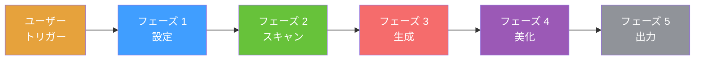
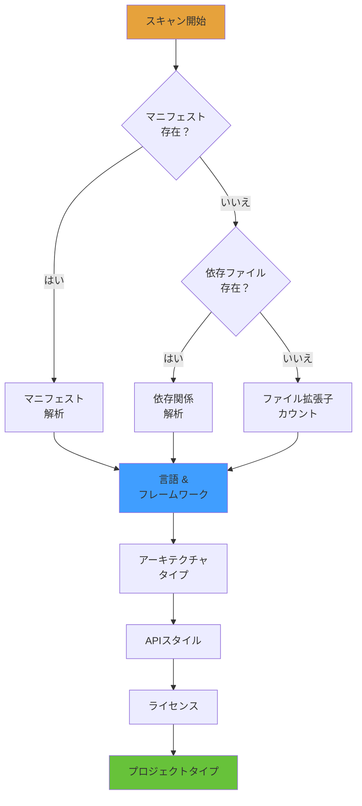
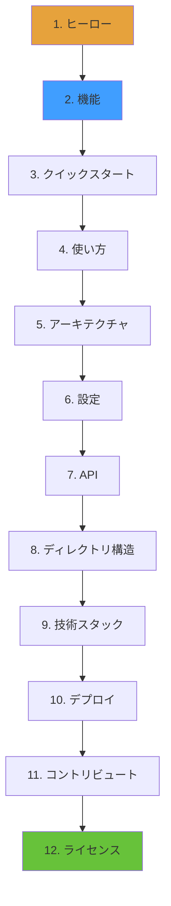
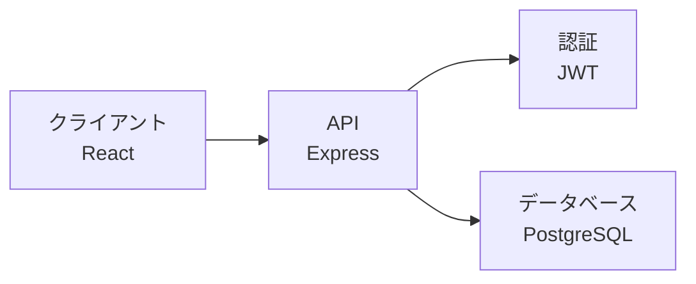
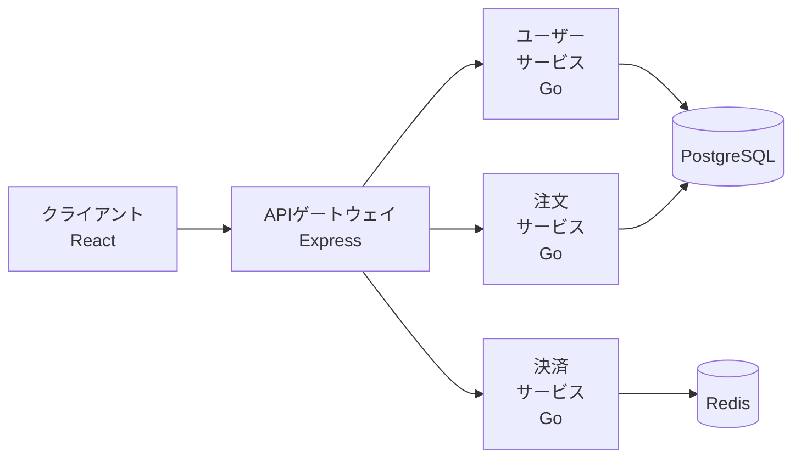
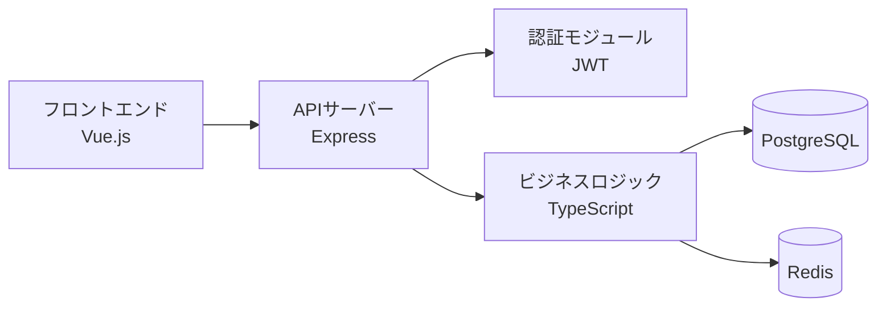
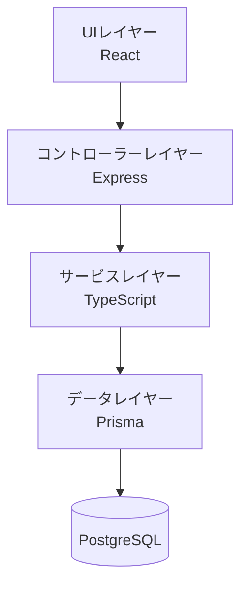
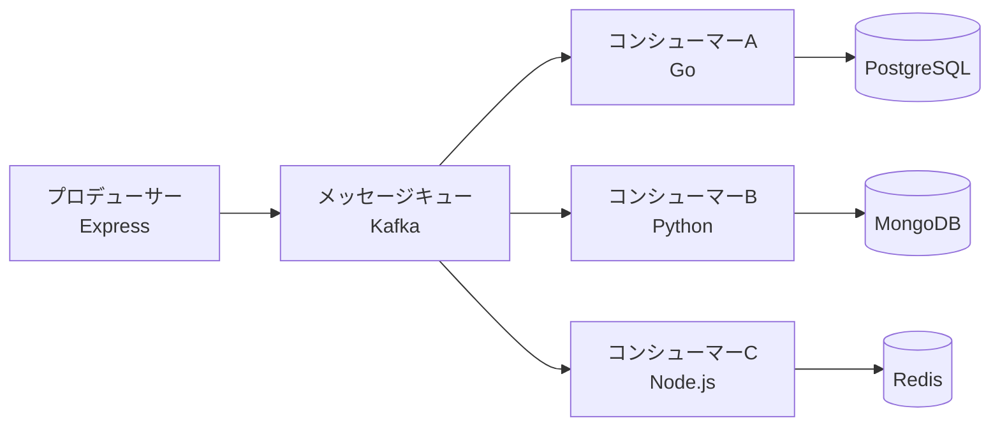

<h1 align="center">General README Skill</h1>
<p align="center">
  <strong>AI コーディングアシスタントを使用して、任意のプロジェクトのプロフェッショナルな README を生成</strong>
  <br />
  <em>ゼロ依存 · マルチプラットフォーム · 多言語対応 · Claude Code、Copilot、Cursor などをサポート</em>
</p>

<p align="center">
  <a href="#クイックスタート"></a>
  <a href="LICENSE"></a>
</p>

<p align="center">
  <a href="https://docs.anthropic.com/en/docs/claude-code"></a>
  <a href="https://github.com/features/copilot"></a>
  <a href="https://cursor.sh"></a>
</p>

<p align="center">
  <a href="README.md">English</a> · <a href="README-zh.md">中文</a> · <a href="README-ja.md">日本語</a> · <a href="README-ko.md">한국어</a> · <a href="README-ru.md">Русский</a>
</p>

## 機能

| 機能 | 説明 |
|---|---|
| 複数のトーンサポート | 3つのライティングプロファイル：エナジェティック、ミニマル、プロフェッショナル |
| バッジシステム | 3つのビジュアルスタイルで shields.io バッジを自動生成 |
| 多言語対応 | 英語、中国語、日本語、韓国語、ロシア語などの README ファイルを生成 |
| ゼロ依存 | 外部CLI、ランタイム、ネットワークサービスは不要 |
| マルチプラットフォーム | Claude Code、GitHub Copilot、Cursor で動作 |
| プライバシー優先 | 機密キー、パスワード、個人情報を自動マスク |

## ワークフロー概要

スキルは **設定 → スキャン → 生成 → 美化 → 出力** のパイプラインに従います：



## フェーズ 1：設定

生成前に設定オプションを収集します。すべてのオプションには固定のデフォルト値があります。

### 1.1 トーンプロファイル選択

README のライティングスタイルを選択：

| プロファイル | 特徴 | リファレンス | ユースケース |
|---|---|---|---|
| **エナジェティック** | 直接的、自信があり、絵文字を許可 | FastAPI | オープンソース、開発者ツール |
| **ミニマル** | 簡潔、コード優先、冗長なし | Tailwind CSS | CLIツール、ライブラリ |
| **プロフェッショナル** | 中立的、構造化、フォーマル | Kubernetes | エンタープライズ、ドキュメント |

**例 — 同じ機能の3つのトーン：**

<details>
<summary><b>エナジェティックスタイル</b></summary>

```markdown
## 機能

- ⚡ **超高速** — サブミリ秒の応答時間
- 🔒 **デフォルトで安全** — JWT認証、CORS、レート制限がすぐに使える
- 🎯 **タイプセーフ** — 完全なTypeScript推論、`any`はゼロ
```
</details>

<details>
<summary><b>ミニマルスタイル</b></summary>

```markdown
## 機能

- 完全な推論を持つタイプセーフなAPI
- ゼロコンフィグのTypeScriptサポート
- 組み込み認証とレート制限
```
</details>

<details>
<summary><b>プロフェッショナルスタイル</b></summary>

```markdown
## 機能

| 機能 | 説明 |
|---|---|
| 型安全性 | ゼロ設定での完全なTypeScript推論 |
| 認証 | ロールベースのアクセス制御を備えたJWTベースの認証 |
```
</details>

### 1.2 バッジスタイル選択

shields.io バッジの外観を選択：

| スタイル | パラメータ | プレビュー |
|---|---|---|
| **フラット**（デフォルト） | `style=flat` |  |
| **フラットスクエア** | `style=flat-square` |  |
| **フォーザバッジ** | `style=for-the-badge` |  |

### 1.3 多言語設定

- **主要言語**（デフォルト：英語）
- **副次言語**（オプション：中国語、日本語、韓国語、スペイン語、フランス語、ロシア語など）

ファイル命名は ISO 639-1 コードに従います：

| 言語 | ファイル | コード |
|---|---|---|
| 英語（主要） | `README.md` | — |
| 中国語（簡体字） | `README-zh.md` | zh |
| 日本語 | `README-ja.md` | ja |
| 韓国語 | `README-ko.md` | ko |
| ロシア語 | `README-ru.md` | ru |

---

## フェーズ 2：プロジェクトスキャン

ビルトインツールを使用してローカルプロジェクトディレクトリをスキャン。**静的ファイルのみ読み取り — 実行、変更、削除は行いません。**

### 2.1 検出パイプライン



### 2.2 検出内容

| 検出項目 | ソースファイル | 出力 |
|---|---|---|
| **言語** | package.json, pyproject.toml, go.mod, Cargo.toml | 主要言語 |
| **フレームワーク** | dependencies/devDependenciesフィールド | React, Vue, Express, Djangoなど |
| **ビルド/CI** | Makefile, Dockerfile, .github/workflows | ビルドコマンド、CIパイプライン |
| **データベース** | DATABASE_URL、ORM設定 | PostgreSQL, Redis, Prismaなど |
| **アーキテクチャ** | ディレクトリ構造、.protoファイル | マイクロサービス、モノリシックなど |
| **APIスタイル** | ルートファイル、.proto、.graphql | REST, gRPC, GraphQL, WebSocket |
| **ライセンス** | LICENSE, LICENSE.md | MIT, Apache-2.0, GPL-3.0など |
| **プロジェクトタイプ** | package.json scripts、binフィールド | ライブラリ、アプリ、CLI、静的サイト |

### 2.3 スキャン出力例

典型的なNode.jsプロジェクト（`package.json`含む）の場合：

```
┌─ 言語: TypeScript
├─ フレームワーク: Express, Prisma
├─ データベース: PostgreSQL, Redis
├─ ビルド: npm scripts, Docker
├─ CI: GitHub Actions
├─ API: REST
├─ ライセンス: MIT
└─ タイプ: アプリケーション
```

---

## フェーズ 3：コンテンツ生成

リファレンスファイルを読み込み、**固定セクション順序**（逆ピラミッド）に従ってコンテンツを生成。

### 3.1 リファレンスファイル

すべてのリファレンスは `references/` フォルダにあります：

| ファイル | 用途 |
|---|---|
| `tone-profiles.md` | 3つのトーンのスタイルルールとサンプルフレーズ |
| `badge-styles.md` | バッジレイアウトとグループ化ルール |
| `badges.md` | 技術 → shields.io バッジURLマッピング（150+エントリ） |
| `diagram-templates.md` | Mermaidテンプレート + SVGフォールバック |
| `section-guidelines.md` | セクション執筆ルールと禁止フレーズ |
| `language-guide.md` | 多言語命名とスイッチャールール |

### 3.2 固定セクション順序

セクションはこの順序で生成されます。**一致するプロジェクトデータがない場合、セクションをスキップ。**



### 3.3 セクション例

#### ヒーローセクション

```markdown
# プロジェクト名

> プロジェクトが何をするかの一文説明


```

#### 機能セクション（プロフェッショナルトーン）

```markdown
## 機能

| 機能 | 説明 |
|---|---|
| 型安全性 | ゼロ設定での完全なTypeScript推論 |
| 認証 | ロールベースのアクセス制御を備えたJWTベースの認証 |
```

#### クイックスタートセクション

````markdown
## クイックスタート

### 前提条件

- Node.js 18+
- PostgreSQL 14+

### インストール

```bash
npm install my-package
```

### 設定

```bash
cp .env.example .env
```

### 実行

```bash
npm run dev
```
````

#### アーキテクチャ図

````markdown
## アーキテクチャ


````

#### ディレクトリ構造

````markdown
## プロジェクト構造

```
src/
├── api/              # APIルートハンドラ
├── services/         # ビジネスロジック
├── models/           # データベースモデル
└── index.ts          # エントリーポイント
```
````

### 3.4 図表テンプレート

スキルには一般的なアーキテクチャ向けの事前構築済みMermaidテンプレートが含まれています：

#### マイクロサービスアーキテクチャ



#### フロントエンド・バックエンド分離



#### モノリシックレイヤード



#### イベントドリブン



### 3.5 バッジグループ化ルール

バッジは以下の順序でグループ化されます：

| 行 | 内容 | 最大数 |
|---|---|---|
| 行1 — アイデンティティ | ビルドステータス、バージョン、ライセンス、主要言語 | 4 |
| 行2 — 技術スタック | フレームワーク、データベース、主要ツール | 6 |
| 行3+ — 条件付き | ダウンロード数、スター、カバレッジ（データが存在する場合のみ） | — |

**例：**

```markdown


```

### 3.6 重要な生成ルール

1. **捏造禁止** — すべての機能、コマンド、コード例は実際のプロジェクトファイルから取得
2. **スタイル一貫性** — すべてのテキストは選択されたトーンプロファイルに従う
3. **バッジルール** — `badge-styles.md`のグループ化とスタイルに従う
4. **プライバシー保護** — 機密キー、パスワード、個人情報をマスク
5. **増分更新** — `<!-- MANUAL-START -->` / `<!-- MANUAL-END -->`でマークされた手動コンテンツを保持

---

## フェーズ 4：美化（自動トリガー）

フェーズ 3 で README を生成した後、このフェーズが自動的にトリガーされ、適切な Markdown 構文を HTML に置き換えて視覚的な表現を向上させます。

### 4.1 実行フロー

**ステップ 1：分析（自動）**
生成された README をスキャンし、美化可能な要素を識別します。

**ステップ 2：確認（ユーザーインタラクション）**
ユーザーに美化提案を表示：

```
AI: README 生成完了！美化の機会を分析中...

以下の美化提案が見つかりました：

1. ✅ [ヒーロー] タイトルを中央揃え → <h1 align="center">
2. ✅ [ヒーロー] 説明を中央揃え太字 → <p align="center"><strong>
3. ✅ [ヒーロー] CTAボタンを追加
4. ✅ [ヒーロー] プラットフォームバッジを中央揃え
5. ⚪ [コンテンツ] テーブルは Markdown のまま維持（保守しやすいため）
6. ⚪ [コード] コードブロックは Markdown のまま維持（シンタックスハイライトあり）

これらの提案を受け入れますか？
[すべて受け入れ] [個別に確認] [すべて拒否]
```

**ステップ 3：実行（自動）**
ユーザーの確認に基づいて美化を適用します。

### 4.2 美化ルール

| 領域 | 戦略 | 理由 |
|---|---|---|
| **ヒーロー** | 常に美化（HTML） | 視覚的な向上が顕著 |
| **コンテンツ** | Markdown を維持 | 保守しやすい |
| **コード/図表** | Markdown を維持 | シンタックスハイライト / GitHub ネイティブサポート |
| **構造** | Markdown を維持 | GitHub のスタイリングで十分 |

詳細なルールと HTML テンプレートは `references/beautification-rules.md` を参照してください。

---

## フェーズ 5：出力

### 5.1 ファイル生成

1. 選択された主要言語で `README.md` を生成
2. 各副次言語の `README-{lang}.md` を生成
3. すべてのREADMEファイルのトップに言語スイッチャーを追加

**言語スイッチャー形式：**

```html
<p align="center">
  <a href="README.md">English</a> · <a href="README-zh.md">中文</a> · <a href="README-ja.md">日本語</a> · <a href="README-ko.md">한국어</a> · <a href="README-ru.md">Русский</a>
</p>
```

### 5.2 出力形式

- UTF-8エンコーディング
- 統一された改行コード（LF）
- セクション間のクリーンな空行
- 末尾の空白なし

---

## クイックスタート

### Claude Code

```bash
mkdir -p .claude/skills/general-readme
cp SKILL.md .claude/skills/general-readme/
cp -r references/ .claude/skills/general-readme/
```

### GitHub Copilot

```bash
mkdir -p .github
cp SKILL.md .github/copilot-instructions.md
cp -r references/ .github/copilot-instructions/references/
```

### Cursor

```bash
mkdir -p .cursor/rules
cp SKILL.md .cursor/rules/general-readme.mdc
cp -r references/ .cursor/rules/references/
```

## 使い方

AIコーディングアシスタントで `/readme` と入力するか、「generate readme」と話してください。

### サポートコマンド

| コマンド | 説明 |
|---|---|
| `/readme` | README生成をトリガー |
| `generate readme` | 自然言語トリガー |
| `write readme` | 自然言語トリガー |
| `帮我写 README` | 中国語トリガー |
| `更新README` | 既存のREADMEを更新 |

### セッション例

```
ユーザー: /readme

AI: READMEのライティングスタイルを選択してください：
    1. Professional（プロフェッショナル） — デフォルト
    2. Energetic（エナジェティック）
    3. Minimal（ミニマル）

ユーザー: 1

AI: バッジスタイルを選択してください：
    1. Flat（フラット） — デフォルト
    2. Flat-square（フラットスクエア）
    3. For-the-badge（フォーザバッジ）

ユーザー: 1

AI: 主要言語を選択してください：
    1. English（英語） — デフォルト
    2. Chinese（中国語）

ユーザー: 1

AI: 副次言語を追加しますか？
    [不要] [中国語] [日本語] [韓国語]

ユーザー: 不要

AI: プロジェクト構造をスキャン中...
    検出: TypeScript, Express, PostgreSQL
    README.mdを生成中...
    
    ✅ README.md 生成完了！美化の機会を分析中...

    以下の美化提案が見つかりました：

    1. ✅ [ヒーロー] タイトルを中央揃え → <h1 align="center">
    2. ✅ [ヒーロー] 説明を中央揃え太字 → <p align="center"><strong>
    3. ✅ [ヒーロー] CTAボタンを追加
    4. ✅ [ヒーロー] プラットフォームバッジを中央揃え
    5. ⚪ [コンテンツ] テーブルは Markdown のまま維持（保守しやすいため）
    6. ⚪ [コード] コードブロックは Markdown のまま維持（シンタックスハイライトあり）

    これらの提案を受け入れますか？
    [すべて受け入れ] [個別に確認] [すべて拒否]

ユーザー: すべて受け入れ

AI: 美化を適用中...
    ✅ README.md が生成され美化されました！確認して必要に応じて調整してください。
```

## プロジェクト構造

```
general-readme-skill/
├── SKILL.md                    # メインスキル定義ファイル
├── LICENSE                     # MITライセンス
├── README.md                   # このファイル
├── examples/                   # READMEサンプルファイル
│   ├── app-readme.md           # フルスタックアプリケーション例
│   ├── cli-readme.md           # CLIツール例
│   └── library-readme.md       # ライブラリ/パッケージ例
├── install/                    # インストールガイド
│   ├── claude-code.md          # Claude Codeセットアップ
│   ├── copilot.md              # GitHub Copilotセットアップ
│   └── cursor.md               # Cursorセットアップ
└── references/                 # リファレンスファイル
    ├── badges.md               # 技術バッジマッピング（150+エントリ）
    ├── badge-styles.md         # バッジレイアウトルール
    ├── beautification-rules.md # フェーズ4美化ルールとHTMLテンプレート
    ├── diagram-templates.md    # Mermaid + SVGテンプレート
    ├── language-guide.md       # 多言語ルール
    ├── section-guidelines.md   # セクション執筆ルール
    └── tone-profiles.md        # 3つのライティングトーン定義
```

## 技術スタック

### ドキュメント

| 技術 | 用途 |
|---|---|
| Markdown | 主要コンテンツフォーマット |
| shields.io | バッジ生成（150+技術マッピング） |
| Mermaid | アーキテクチャ図（4つのテンプレートタイプ） |

### サポートプラットフォーム

| プラットフォーム | 統合方法 |
|---|---|
| Claude Code | `.claude/skills/`ディレクトリ |
| GitHub Copilot | `.github/copilot-instructions.md` |
| Cursor | `.cursor/rules/`ディレクトリ |

## コントリビュート

1. リポジトリをフォーク
2. 機能ブランチを作成（`git checkout -b feature/amazing`）
3. 変更をコミット（`git commit -m 'feat: add amazing feature'`）
4. ブランチにプッシュ（`git push origin feature/amazing`）
5. Pull Requestを開く

## ライセンス

[MIT](LICENSE)
