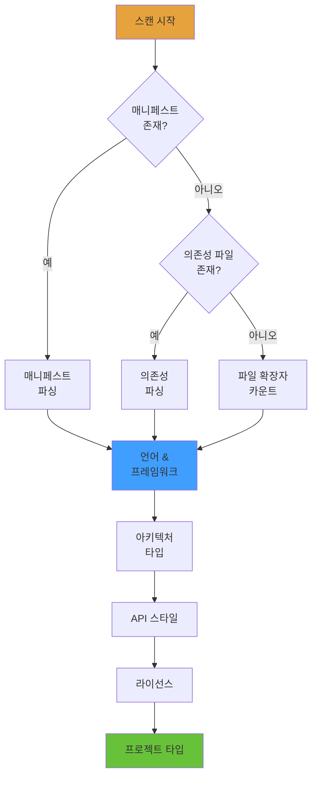
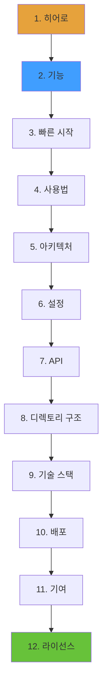
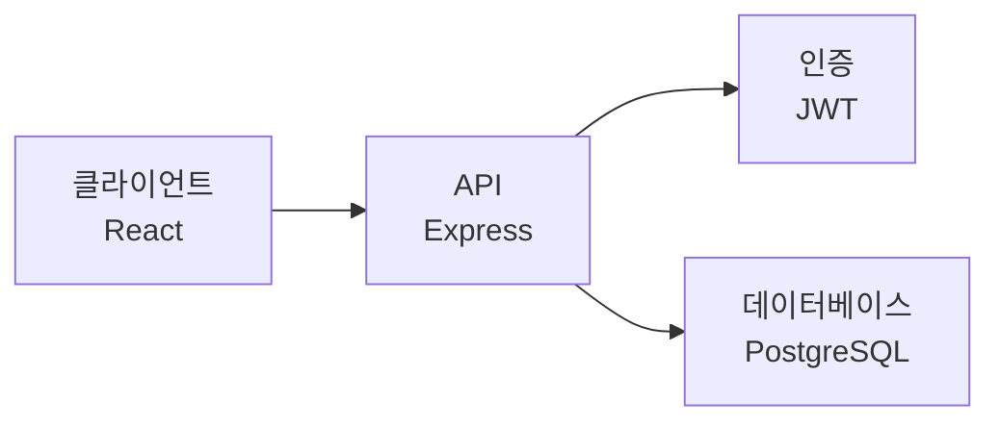
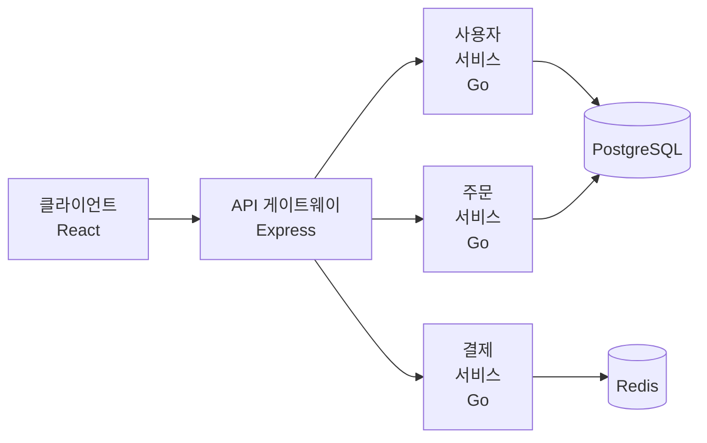
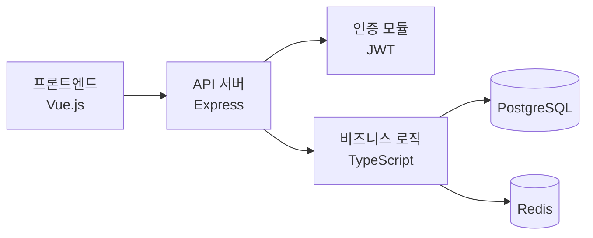
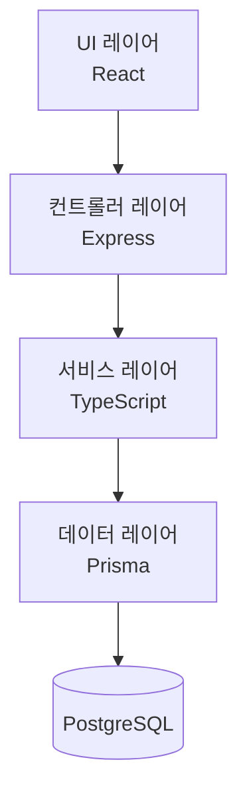
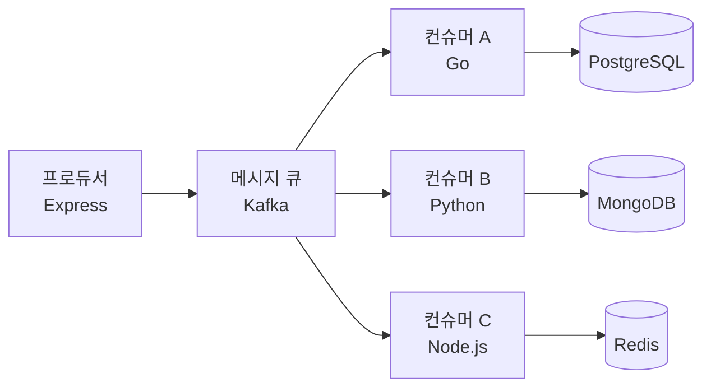

<h1 align="center">General README Skill</h1>
<p align="center">
  <strong>AI 코딩 어시스턴트를 사용하여 모든 프로젝트의 전문적인 README 파일 생성</strong>
  <br />
  <em>제로 의존성 · 멀티 플랫폼 · 다국어 지원 · Claude Code, Copilot, Cursor 등을 지원</em>
</p>

<p align="center">
  <a href="#빠른-시작"></a>
  <a href="LICENSE"></a>
</p>

<p align="center">
  <a href="https://docs.anthropic.com/en/docs/claude-code"></a>
  <a href="https://github.com/features/copilot"></a>
  <a href="https://cursor.sh"></a>
</p>

<p align="center">
  <a href="README.md">English</a> · <a href="README-zh.md">中文</a> · <a href="README-ja.md">日本語</a> · <a href="README-ko.md">한국어</a> · <a href="README-ru.md">Русский</a>
</p>

## 기능

| 기능 | 설명 |
|---|---|
| 다중 톤 지원 | 3가지 작성 프로파일: 에너제틱, 미니멀, 프로페셔널 |
| 배지 시스템 | 3가지 비주얼 스타일로 shields.io 배지 자동 생성 |
| 다국어 지원 | 영어, 중국어, 일본어, 한국어, 러시아어 등 README 파일 생성 |
| 제로 의존성 | 외부 CLI, 런타임, 네트워크 서비스 불필요 |
| 멀티 플랫폼 | Claude Code, GitHub Copilot, Cursor에서 작동 |
| 개인정보 보호 | 민감한 키, 비밀번호, 개인 정보 자동 마스킹 |

## 워크플로우 개요

스킬은 **구성 → 스캔 → 생성 → 출력** 파이프라인을 따릅니다:


## 단계 1: 구성

생성 전에 구성 옵션을 수집합니다. 모든 옵션에는 고정된 기본값이 있습니다.

### 1.1 톤 프로파일 선택

README 작성 스타일 선택:

| 프로파일 | 특징 | 레퍼런스 | 사용 사례 |
|---|---|---|---|
| **에너제틱** | 직접적, 자신감, 이모지 허용 | FastAPI | 오픈 소스, 개발자 도구 |
| **미니멀** | 간결, 코드 우선, 불필요 없음 | Tailwind CSS | CLI 도구, 라이브러리 |
| **프로페셔널** | 중립적, 구조화, 공식적 | Kubernetes | 엔터프라이즈, 문서 |

**예시 — 같은 기능의 세 가지 톤:**

<details>
<summary><b>에너제틱 스타일</b></summary>

```markdown
## 기능

- ⚡ **초고속** — 서브밀리초 응답 시간
- 🔒 **기본 보안** — JWT 인증, CORS, 속도 제한 즉시 사용 가능
- 🎯 **타입 안전** — 완전한 TypeScript 추론, `any` 제로
```
</details>

<details>
<summary><b>미니멀 스타일</b></summary>

```markdown
## 기능

- 완전한 추론을 갖춘 타입 안전한 API
- 제로 컨피그 TypeScript 지원
- 내장 인증 및 속도 제한
```
</details>

<details>
<summary><b>프로페셔널 스타일</b></summary>

```markdown
## 기능

| 기능 | 설명 |
|---|---|
| 타입 안전 | 제로 설정으로 완전한 TypeScript 추론 |
| 인증 | 역할 기반 액세스 제어를 갖춘 JWT 기반 인증 |
```
</details>

### 1.2 배지 스타일 선택

shields.io 배지 모양 선택:

| 스타일 | 매개변수 | 미리보기 |
|---|---|---|
| **플랫**（기본） | `style=flat` |  |
| **플랫스퀘어** | `style=flat-square` |  |
| **포더배지** | `style=for-the-badge` |  |

### 1.3 다국어 설정

- **주요 언어**（기본: 영어）
- **보조 언어**（선택: 중국어, 일본어, 한국어, 스페인어, 프랑스어, 러시아어 등）

파일 명명은 ISO 639-1 코드를 따릅니다:

| 언어 | 파일 | 코드 |
|---|---|---|
| 영어（주요） | `README.md` | — |
| 중국어（간체） | `README-zh.md` | zh |
| 일본어 | `README-ja.md` | ja |
| 한국어 | `README-ko.md` | ko |
| 러시아어 | `README-ru.md` | ru |

---

## 단계 2: 프로젝트 스캔

내장 도구를 사용하여 로컬 프로젝트 디렉토리를 스캔합니다. **정적 파일만 읽기 — 실행, 수정, 삭제는 하지 않습니다.**

### 2.1 감지 파이프라인



### 2.2 감지 내용

| 감지 항목 | 소스 파일 | 출력 |
|---|---|---|
| **언어** | package.json, pyproject.toml, go.mod, Cargo.toml | 주요 언어 |
| **프레임워크** | dependencies/devDependencies 필드 | React, Vue, Express, Django 등 |
| **빌드/CI** | Makefile, Dockerfile, .github/workflows | 빌드 명령, CI 파이프라인 |
| **데이터베이스** | DATABASE_URL, ORM 설정 | PostgreSQL, Redis, Prisma 등 |
| **아키텍처** | 디렉토리 구조, .proto 파일 | 마이크로서비스, 모놀리식 등 |
| **API 스타일** | 라우트 파일, .proto, .graphql | REST, gRPC, GraphQL, WebSocket |
| **라이선스** | LICENSE, LICENSE.md | MIT, Apache-2.0, GPL-3.0 등 |
| **프로젝트 타입** | package.json scripts, bin 필드 | 라이브러리, 앱, CLI, 정적 사이트 |

### 2.3 스캔 출력 예시

典型的なNode.jsプロジェクト（`package.json`含む）の場合:

```
┌─ 언어: TypeScript
├─ 프레임워크: Express, Prisma
├─ 데이터베이스: PostgreSQL, Redis
├─ 빌드: npm scripts, Docker
├─ CI: GitHub Actions
├─ API: REST
├─ 라이선스: MIT
└─ 타입: 애플리케이션
```

---

## 단계 3: 콘텐츠 생성

레퍼런스 파일을 로드한 후 **고정 섹션 순서**（역 피라미드）에 따라 콘텐츠를 생성합니다.

### 3.1 레퍼런스 파일

모든 레퍼런스는 `references/` 폴더에 있습니다:

| 파일 | 용도 |
|---|---|
| `tone-profiles.md` | 3가지 톤의 스타일 규칙과 샘플 문구 |
| `badge-styles.md` | 배지 레이아웃 및 그룹화 규칙 |
| `badges.md` | 기술 → shields.io 배지 URL 매핑（150+ 항목） |
| `diagram-templates.md` | Mermaid 템플릿 + SVG 폴백 |
| `section-guidelines.md` | 섹션 작성 규칙 및 금지 문구 |
| `language-guide.md` | 다국어 명명 및 스위처 규칙 |

### 3.2 고정 섹션 순서

섹션은 이 순서로 생성됩니다. **일치하는 프로젝트 데이터가 없으면 섹션을 건너뜁니다.**



### 3.3 섹션 예시

#### 히어로 섹션

```markdown
# 프로젝트 이름

> 프로젝트가 무엇을 하는지 한 줄 설명


```

#### 기능 섹션（프로페셔널 톤）

```markdown
## 기능

| 기능 | 설명 |
|---|---|
| 타입 안전 | 제로 설정으로 완전한 TypeScript 추론 |
| 인증 | 역할 기반 액세스 제어를 갖춘 JWT 기반 인증 |
```

#### 빠른 시작 섹션

```markdown
## 빠른 시작

### 사전 요구사항

- Node.js 18+
- PostgreSQL 14+

### 설치

```bash
npm install my-package
```

### 설정

```bash
cp .env.example .env
```

### 실행

```bash
npm run dev
```
```

#### 아키텍처 다이어그램

```markdown
## 아키텍처


```

#### 디렉토리 구조

```markdown
## 프로젝트 구조

```
src/
├── api/              # API 라우트 핸들러
├── services/         # 비즈니스 로직
├── models/           # 데이터베이스 모델
└── index.ts          # 진입점
```
```

### 3.4 다이어그램 템플릿

스킬에는 일반적인 아키텍처를 위한 사전 구축된 Mermaid 템플릿이 포함되어 있습니다:

#### 마이크로서비스 아키텍처



#### 프론트엔드-백엔드 분리



#### 모놀리식 레이어드



#### 이벤트 드리븐



### 3.5 배지 그룹화 규칙

배지는 다음 순서로 그룹화됩니다:

| 행 | 내용 | 최대 수 |
|---|---|---|
| 행 1 — 아이덴티티 | 빌드 상태, 버전, 라이선스, 주요 언어 | 4 |
| 행 2 — 기술 스택 | 프레임워크, 데이터베이스, 주요 도구 | 6 |
| 행 3+ — 조건부 | 다운로드 수, 스타, 커버리지（데이터가 존재할 때만） | — |

**예시:**

```markdown


```

### 3.6 핵심 생성 규칙

1. **조작 금지** — 모든 기능, 명령, 코드 예시는 실제 프로젝트 파일에서 가져와야 함
2. **스타일 일관성** — 모든 텍스트는 선택된 톤 프로파일을 따름
3. **배지 규칙** — `badge-styles.md`의 그룹화 및 스타일을 따름
4. **개인정보 보호** — 민감한 키, 비밀번호, 개인 정보를 마스킹
5. **증분 업데이트** — `<!-- MANUAL-START -->` / `<!-- MANUAL-END -->`로 표시된 수동 콘텐츠를 유지

---

## 단계 4: 출력

### 4.1 파일 생성

1. 선택된 주요 언어로 `README.md` 생성
2. 각 보조 언어의 `README-{lang}.md` 생성
3. 모든 README 파일 상단에 언어 스위처 추가

**언어 스위처 형식:**

```markdown
<div align="right">

English · [中文](README-zh.md) · [日本語](README-ja.md) · [한국어](README-ko.md) · [Русский](README-ru.md)

</div>
```

### 4.2 출력 형식

- UTF-8 인코딩
- 통일된 줄 바꿈（LF）
- 섹션 간 깔끔한 빈 줄
- 끝에 공백 없음

---

## 빠른 시작

### Claude Code

```bash
mkdir -p .claude/skills/general-readme
cp SKILL.md .claude/skills/general-readme/
cp -r references/ .claude/skills/general-readme/
```

### GitHub Copilot

```bash
mkdir -p .github
cp SKILL.md .github/copilot-instructions.md
cp -r references/ .github/copilot-instructions/references/
```

### Cursor

```bash
mkdir -p .cursor/rules
cp SKILL.md .cursor/rules/general-readme.mdc
cp -r references/ .cursor/rules/references/
```

## 사용법

AI 코딩 어시스턴트에서 `/readme`를 입력하거나 "generate readme"라고 말하세요.

### 지원 명령어

| 명령어 | 설명 |
|---|---|
| `/readme` | README 생성 트리거 |
| `generate readme` | 자연어 트리거 |
| `write readme` | 자연어 트리거 |
| `帮我写 README` | 중국어 트리거 |
| `更新README` | 기존 README 업데이트 |

### 세션 예시

```
사용자: /readme

AI: README 작성 스타일을 선택하세요:
    1. Professional（프로페셔널） — 기본
    2. Energetic（에너제틱）
    3. Minimal（미니멀）

사용자: 1

AI: 배지 스타일을 선택하세요:
    1. Flat（플랫） — 기본
    2. Flat-square（플랫스퀘어）
    3. For-the-badge（포더배지）

사용자: 1

AI: 주요 언어를 선택하세요:
    1. English（영어） — 기본
    2. Chinese（중국어）

사용자: 1

AI: 보조 언어를 추가하시겠습니까?
    [필요 없음] [중국어] [일본어] [한국어]

사용자: 필요 없음

AI: 프로젝트 구조를 스캔 중...
    감지됨: TypeScript, Express, PostgreSQL
    README.md 생성 중...
    
    ✅ README.md가 생성되었습니다! 확인하고 필요에 따라 조정하세요.
```

## 프로젝트 구조

```
general-readme-skill/
├── SKILL.md                    # 메인 스킬 정의 파일
├── LICENSE                     # MIT 라이선스
├── README.md                   # 이 파일
├── examples/                   # README 예제 파일
│   ├── app-readme.md           # 풀스택 애플리케이션 예제
│   ├── cli-readme.md           # CLI 도구 예제
│   └── library-readme.md       # 라이브러리/패키지 예제
├── install/                    # 설치 가이드
│   ├── claude-code.md          # Claude Code 설정
│   ├── copilot.md              # GitHub Copilot 설정
│   └── cursor.md               # Cursor 설정
└── references/                 # 참조 파일
    ├── badges.md               # 기술 배지 매핑（150+ 항목）
    ├── badge-styles.md         # 배지 레이아웃 규칙
    ├── diagram-templates.md    # Mermaid + SVG 템플릿
    ├── language-guide.md       # 다국어 규칙
    ├── section-guidelines.md   # 섹션 작성 규칙
    └── tone-profiles.md        # 3가지 작성 톤 정의
```

## 기술 스택

### 문서

| 기술 | 용도 |
|---|---|
| Markdown | 주요 콘텐츠 형식 |
| shields.io | 배지 생성（150+ 기술 매핑） |
| Mermaid | 아키텍처 다이어그램（4가지 템플릿 유형） |

### 지원 플랫폼

| 플랫폼 | 통합 방법 |
|---|---|
| Claude Code | `.claude/skills/` 디렉토리 |
| GitHub Copilot | `.github/copilot-instructions.md` |
| Cursor | `.cursor/rules/` 디렉토리 |

## 기여하기

1. 리포지토리를 포크
2. 기능 브랜치 생성（`git checkout -b feature/amazing`）
3. 변경 사항 커밋（`git commit -m 'feat: add amazing feature'`）
4. 브랜치에 푸시（`git push origin feature/amazing`）
5. Pull Request 열기

## 라이선스

[MIT](LICENSE)
