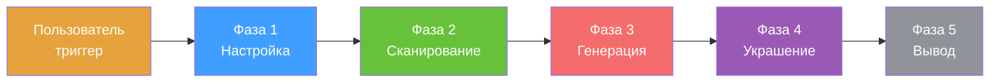
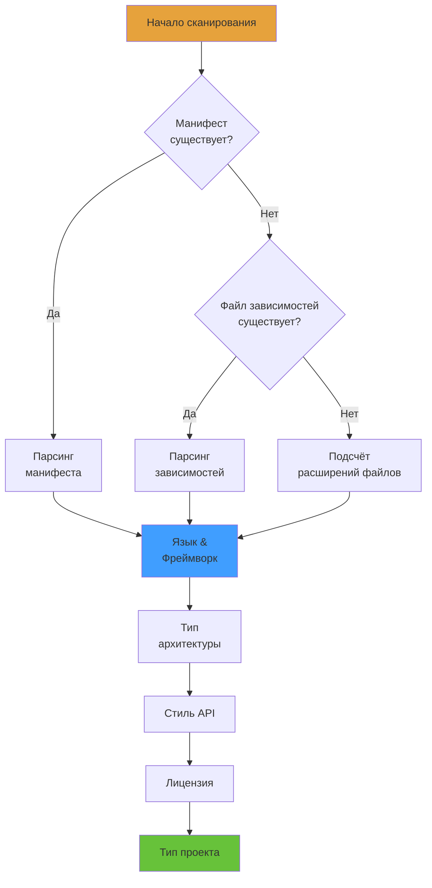
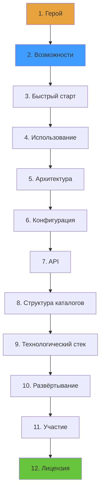
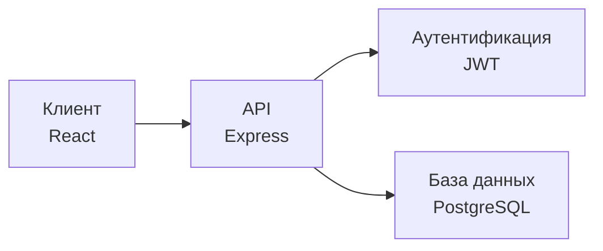
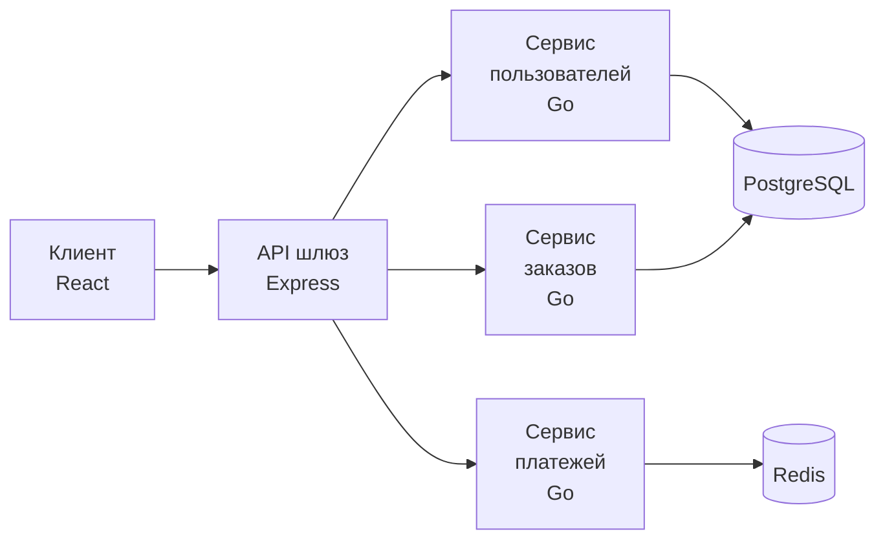
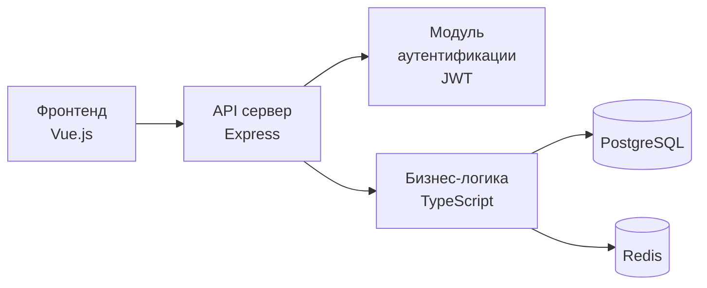
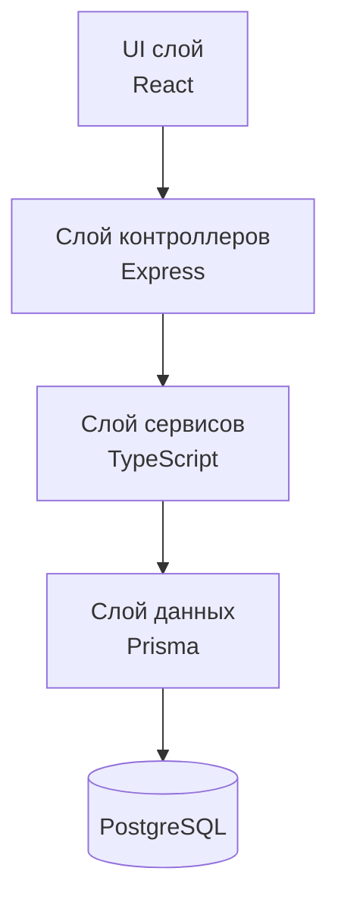
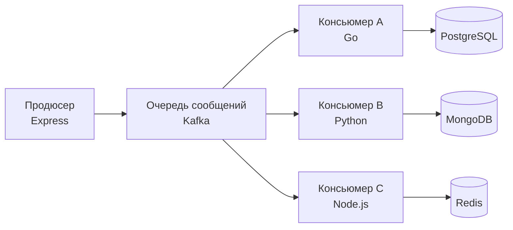

<h1 align="center">General README Skill</h1>
<p align="center">
  <strong>Генерация профессиональных README файлов для любого проекта с помощью AI-ассистентов</strong>
  <br />
  <em>Нулевые зависимости · Кроссплатформенность · Многоязычность · Поддержка Claude Code, Copilot, Cursor и др.</em>
</p>

<p align="center">
  <a href="#быстрый-старт"></a>
  <a href="LICENSE"></a>
</p>

<p align="center">
  <a href="https://docs.anthropic.com/en/docs/claude-code"></a>
  <a href="https://github.com/features/copilot"></a>
  <a href="https://cursor.sh"></a>
</p>

<p align="center">
  <a href="README.md">English</a> · <a href="README-zh.md">中文</a> · <a href="README-ja.md">日本語</a> · <a href="README-ko.md">한국어</a> · <a href="README-ru.md">Русский</a>
</p>

## Возможности

| Возможность | Описание |
|---|---|
| Множество стилей | Три профиля написания: энергичный, минималистичный и профессиональный |
| Система бейджей | Автоматическая генерация бейджей shields.io в трёх визуальных стилях |
| Многоязычность | Генерация README на английском, китайском, японском, корейском, русском и других языках |
| Нулевые зависимости | Не требует внешних CLI, рантаймов или сетевых сервисов |
| Кроссплатформенность | Работает с Claude Code, GitHub Copilot и Cursor |
| Приватность | Автоматическая маскировка чувствительных ключей, паролей и личной информации |

## Обзор рабочего процесса

Навык следует конвейеру **Настройка → Сканирование → Генерация → Украшение → Вывод**:



## Фаза 1: Настройка

Сбор параметров конфигурации перед генерацией. Все параметры имеют фиксированные значения по умолчанию.

### 1.1 Выбор тона профиля

Выберите стиль написания README:

| Профиль | Особенности | Референс | Сценарий использования |
|---|---|---|---|
| **Энергичный** | Прямой, уверенный, допускает эмодзи | FastAPI | Открытый исходный код, инструменты разработчика |
| **Минималистичный** | Лаконичный, код-первый, без избыточности | Tailwind CSS | CLI инструменты, библиотеки |
| **Профессиональный** | Нейтральный, структурированный, формальный | Kubernetes | Корпоративный, документация |

**Пример — одна функция в трёх стилях:**

<details>
<summary><b>Энергичный стиль</b></summary>

```markdown
## Возможности

- ⚡ **Молниеносный** — Субмиллисекундное время отклика
- 🔒 **Безопасный по умолчанию** — JWT аутентификация, CORS, ограничение частоты запросов из коробки
- 🎯 **Типобезопасный** — Полный вывод TypeScript, ноль `any`
```
</details>

<details>
<summary><b>Минималистичный стиль</b></summary>

```markdown
## Возможности

- Типобезопасный API с полным выводом
- Поддержка TypeScript без конфигурации
- Встроенная аутентификация и ограничение частоты
```
</details>

<details>
<summary><b>Профессиональный стиль</b></summary>

```markdown
## Возможности

| Функция | Описание |
|---|---|
| Типобезопасность | Полный вывод TypeScript с нулевой конфигурацией |
| Аутентификация | Аутентификация на основе JWT с контролем доступа на основе ролей |
```
</details>

### 1.2 Выбор стиля бейджей

Выберите внешний вид бейджей shields.io:

| Стиль | Параметр | Превью |
|---|---|---|
| **Плоский**（по умолчанию） | `style=flat` |  |
| **Плоский квадратный** | `style=flat-square` |  |
| **Для бейджа** | `style=for-the-badge` |  |

### 1.3 Многоязычная настройка

- **Основной язык**（по умолчанию: английский）
- **Дополнительные языки**（опционально: китайский, японский, корейский, испанский, французский, русский и др.）

Именование файлов遵循 ISO 639-1 кодам:

| Язык | Файл | Код |
|---|---|---|
| Английский（основной） | `README.md` | — |
| Китайский（упрощённый） | `README-zh.md` | zh |
| Японский | `README-ja.md` | ja |
| Корейский | `README-ko.md` | ko |
| Русский | `README-ru.md` | ru |

---

## Фаза 2: Сканирование проекта

Использование встроенных инструментов для сканирования локальной директории проекта. **Только чтение статических файлов — никогда не выполнять, изменять или удалять.**

### 2.1 Конвейер обнаружения



### 2.2 Что обнаруживается

| Обнаружение | Исходные файлы | Результат |
|---|---|---|
| **Язык** | package.json, pyproject.toml, go.mod, Cargo.toml | Основной язык |
| **Фреймворк** | Поля dependencies/devDependencies | React, Vue, Express, Django и др. |
| **Сборка/CI** | Makefile, Dockerfile, .github/workflows | Команды сборки, CI конвейер |
| **База данных** | DATABASE_URL, конфигурации ORM | PostgreSQL, Redis, Prisma и др. |
| **Архитектура** | Структура каталогов, .proto файлы | Микросервисы, монолит и др. |
| **Стиль API** | Файлы маршрутов, .proto, .graphql | REST, gRPC, GraphQL, WebSocket |
| **Лицензия** | LICENSE, LICENSE.md | MIT, Apache-2.0, GPL-3.0 и др. |
| **Тип проекта** | Скрипты package.json, поле bin | Библиотека, приложение, CLI, статический сайт |

### 2.3 Пример вывода сканирования

Для типичного Node.js проекта（с `package.json`）:

```
┌─ Язык: TypeScript
├─ Фреймворк: Express, Prisma
├─ База данных: PostgreSQL, Redis
├─ Сборка: npm scripts, Docker
├─ CI: GitHub Actions
├─ API: REST
├─ Лицензия: MIT
└─ Тип: Приложение
```

---

## Фаза 3: Генерация контента

Зрузка справочных файлов, затем генерация контента по **фиксированному порядку секций**（перевёрнутая пирамида）.

### 3.1 Справочные файлы

Все справочные файлы находятся в папке `references/`:

| Файл | Назначение |
|---|---|
| `tone-profiles.md` | Правила стиля и примеры фраз для 3 тонов |
| `badge-styles.md` | Правила макета и группировки бейджей |
| `badges.md` | Маппинг технологий на URL бейджей shields.io（150+ записей） |
| `diagram-templates.md` | Шаблоны Mermaid + SVG запасной вариант |
| `section-guidelines.md` | Правила написания секций и запрещённые фразы |
| `language-guide.md` | Правила многоязычного именования и переключателя |

### 3.2 Фиксированный порядок секций

Секции генерируются в этом порядке. **Пропустить секцию, если нет соответствующих данных проекта.**



### 3.3 Примеры секций

#### Секция «Герой»

```markdown
# Название проекта

> Однострочное описание того, что делает проект


```

#### Секция «Возможности»（профессиональный тон）

```markdown
## Возможности

| Функция | Описание |
|---|---|
| Типобезопасность | Полный вывод TypeScript с нулевой конфигурацией |
| Аутентификация | Аутентификация на основе JWT с контролем доступа на основе ролей |
```

#### Секция «Быстрый старт»

````markdown
## Быстрый старт

### Предварительные требования

- Node.js 18+
- PostgreSQL 14+

### Установка

```bash
npm install my-package
```

### Настройка

```bash
cp .env.example .env
```

### Запуск

```bash
npm run dev
```
````

#### Диаграмма архитектуры

````markdown
## Архитектура


````

#### Структура каталогов

````markdown
## Структура проекта

```
src/
├── api/              # Обработчики маршрутов API
├── services/         # Бизнес-логика
├── models/           # Модели базы данных
└── index.ts          # Точка входа
```
````

### 3.4 Шаблоны диаграмм

Навык содержит предварительно созданные шаблоны Mermaid для типичных архитектур:

#### Микросервисная архитектура



#### Разделение фронтенда и бэкенда



#### Монолитная многослойная



#### Событийно-ориентированная



### 3.5 Правила группировки бейджей

Бейджи группируются в следующем порядке:

| Строка | Содержание | Максимум |
|---|---|---|
| Строка 1 — Идентификация | Статус сборки, версия, лицензия, основной язык | 4 |
| Строка 2 — Технологический стек | Фреймворк, база данных, ключевые инструменты | 6 |
| Строка 3+ — Условные | Количество загрузок, звёзды, покрытие（только если данные существуют） | — |

**Пример:**

```markdown


```

### 3.6 Критические правила генерации

1. **Запрет на подделку** — Все функции, команды, примеры кода должны быть взяты из реальных файлов проекта
2. **Согласованность стиля** — Весь текст следует выбранному тону профиля
3. **Правила бейджей** — Следовать группировке и стилю в `badge-styles.md`
4. **Защита приватности** — Маскировать чувствительные ключи, пароли и личную информацию
5. **Инкрементальное обновление** — Сохранять ручной контент, помеченный `<!-- MANUAL-START -->` / `<!-- MANUAL-END -->`

---

## Фаза 4: Украшение (автозапуск)

После того как Фаза 3 сгенерирует README, эта фаза автоматически запускается для улучшения визуального представления путём замены подходящего синтаксиса Markdown на HTML.

### 4.1 Процесс выполнения

**Шаг 1: Анализ (автоматический)**
Сканирование сгенерированного README и выявление элементов, которые можно улучшить.

**Шаг 2: Подтверждение (взаимодействие с пользователем)**
Отображение предложений по улучшению:

```
AI: Генерация README завершена! Анализ возможностей улучшения...

Найдены следующие предложения:

1. ✅ [Герой] Заголовок по центру → <h1 align="center">
2. ✅ [Герой] Описание по центру жирным → <p align="center"><strong>
3. ✅ [Герой] Добавить CTA кнопки
4. ✅ [Герой] Платформенные бейджи по центру
5. ⚪ [Контент] Таблицы остаются в Markdown (легче поддерживать)
6. ⚪ [Код] Блоки кода остаются в Markdown (подсветка синтаксиса)

Принять эти предложения?
[Принять все] [Подтвердить каждое] [Отклонить все]
```

**Шаг 3: Выполнение (автоматический)**
Применение выбранных улучшений на основе подтверждения пользователя.

### 4.2 Правила украшения

| Область | Стратегия | Причина |
|---|---|---|
| **Герой** | Всегда украшать (HTML) | Значительное визуальное улучшение |
| **Контент** | Оставить Markdown | Легче поддерживать |
| **Код/Диаграммы** | Оставить Markdown | Подсветка синтаксиса / нативная поддержка GitHub |
| **Структура** | Оставить Markdown | Стилизации GitHub достаточно |

Подробные правила и HTML-шаблоны см. в `references/beautification-rules.md`.

---

## Фаза 5: Вывод

### 5.1 Генерация файлов

1. Генерация `README.md` на выбранном основном языке
2. Генерация вторичных файлов: `README-{lang}.md` для каждого дополнительного языка
3. Добавление переключателя языка в верхней части каждого README файла

**Формат переключателя языка:**

```html
<p align="center">
  <a href="README.md">English</a> · <a href="README-zh.md">中文</a> · <a href="README-ja.md">日本語</a> · <a href="README-ko.md">한국어</a> · <a href="README-ru.md">Русский</a>
</p>
```

### 5.2 Формат вывода

- Кодировка UTF-8
- Единые переводы строк（LF）
- Чистые пустые строки между секциями
- Без завершающих пробелов

---

## Быстрый старт

### Claude Code

```bash
mkdir -p .claude/skills/general-readme
cp SKILL.md .claude/skills/general-readme/
cp -r references/ .claude/skills/general-readme/
```

### GitHub Copilot

```bash
mkdir -p .github
cp SKILL.md .github/copilot-instructions.md
cp -r references/ .github/copilot-instructions/references/
```

### Cursor

```bash
mkdir -p .cursor/rules
cp SKILL.md .cursor/rules/general-readme.mdc
cp -r references/ .cursor/rules/references/
```

## Использование

Введите `/readme` или скажите "generate readme" в вашем AI-ассистенте.

### Поддерживаемые команды

| Команда | Описание |
|---|---|
| `/readme` | Запуск генерации README |
| `generate readme` | Триггер на естественном языке |
| `write readme` | Триггер на естественном языке |
| `帮我写 README` | Триггер на китайском языке |
| `更新README` | Обновление существующего README |

### Пример сессии

```
Пользователь: /readme

AI: Выберите стиль написания README:
    1. Professional（профессиональный） — по умолчанию
    2. Energetic（энергичный）
    3. Minimal（минималистичный）

Пользователь: 1

AI: Выберите стиль бейджей:
    1. Flat（плоский） — по умолчанию
    2. Flat-square（плоский квадратный）
    3. For-the-badge（для бейджа）

Пользователь: 1

AI: Выберите основной язык:
    1. English（английский） — по умолчанию
    2. Chinese（китайский）

Пользователь: 1

AI: Хотите добавить дополнительные языки?
    [Нет] [Китайский] [Японский] [Корейский]

Пользователь: Нет

AI: Сканирование структуры проекта...
    Обнаружено: TypeScript, Express, PostgreSQL
    Генерация README.md...
    
    ✅ Генерация README.md завершена! Анализ возможностей улучшения...

    Найдены следующие предложения:

    1. ✅ [Герой] Заголовок по центру → <h1 align="center">
    2. ✅ [Герой] Описание по центру жирным → <p align="center"><strong>
    3. ✅ [Герой] Добавить CTA кнопки
    4. ✅ [Герой] Платформенные бейджи по центру
    5. ⚪ [Контент] Таблицы остаются в Markdown (легче поддерживать)
    6. ⚪ [Код] Блоки кода остаются в Markdown (подсветка синтаксиса)

    Принять эти предложения?
    [Принять все] [Подтвердить каждое] [Отклонить все]

Пользователь: Принять все

AI: Применение улучшений...
    ✅ README.md создан и улучшен! Проверьте и при необходимости откорректируйте.
```

## Структура проекта

```
general-readme-skill/
├── SKILL.md                    # Основной файл определения навыка
├── LICENSE                     # Лицензия MIT
├── README.md                   # Этот файл
├── examples/                   # Примеры README файлов
│   ├── app-readme.md           # Пример полноценного приложения
│   ├── cli-readme.md           # Пример CLI инструмента
│   └── library-readme.md       # Пример библиотеки/пакета
├── install/                    # Руководства по установке
│   ├── claude-code.md          # Настройка Claude Code
│   ├── copilot.md              # Настройка GitHub Copilot
│   └── cursor.md               # Настройка Cursor
└── references/                 # Справочные файлы
    ├── badges.md               # Маппинг технологий на бейджи（150+ записей）
    ├── badge-styles.md         # Правила макета бейджей
    ├── beautification-rules.md # Правила украшения Фазы 4 и HTML-шаблоны
    ├── diagram-templates.md    # Шаблоны Mermaid + SVG
    ├── language-guide.md       # Правила многоязычности
    ├── section-guidelines.md   # Правила написания секций
    └── tone-profiles.md        # Определения 3 стилей написания
```

## Технологический стек

### Документация

| Технология | Назначение |
|---|---|
| Markdown | Основной формат контента |
| shields.io | Генерация бейджей（150+ маппингов технологий） |
| Mermaid | Диаграммы архитектуры（4 типа шаблонов） |

### Поддерживаемые платформы

| Платформа | Метод интеграции |
|---|---|
| Claude Code | Директория `.claude/skills/` |
| GitHub Copilot | `.github/copilot-instructions.md` |
| Cursor | Директория `.cursor/rules/` |

## Участие в разработке

1. Форкните репозиторий
2. Создайте ветку для функции（`git checkout -b feature/amazing`）
3. Закоммитьте изменения（`git commit -m 'feat: add amazing feature'`）
4. Запушьте в ветку（`git push origin feature/amazing`）
5. Откройте Pull Request

## Лицензия

[MIT](LICENSE)
