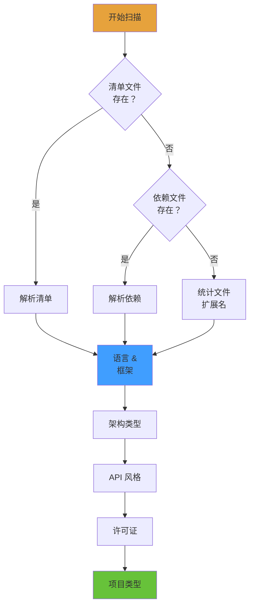
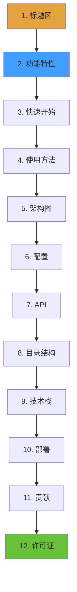
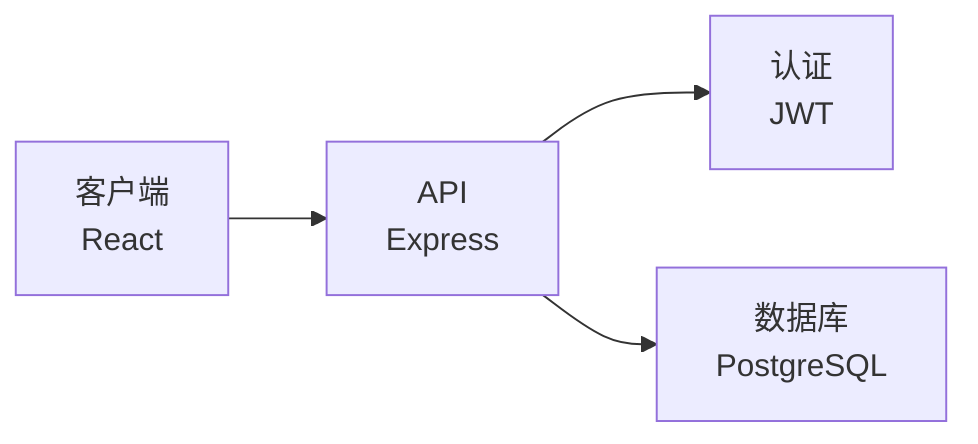
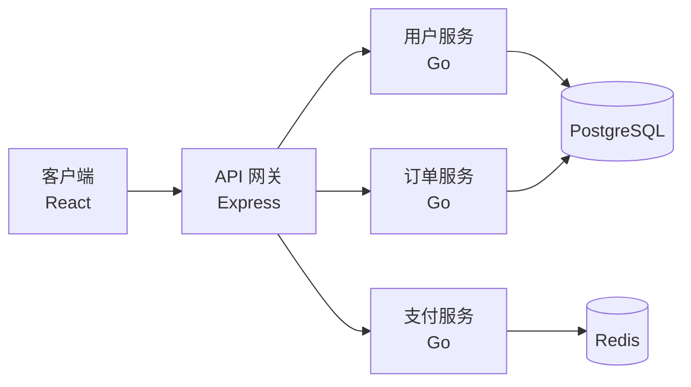
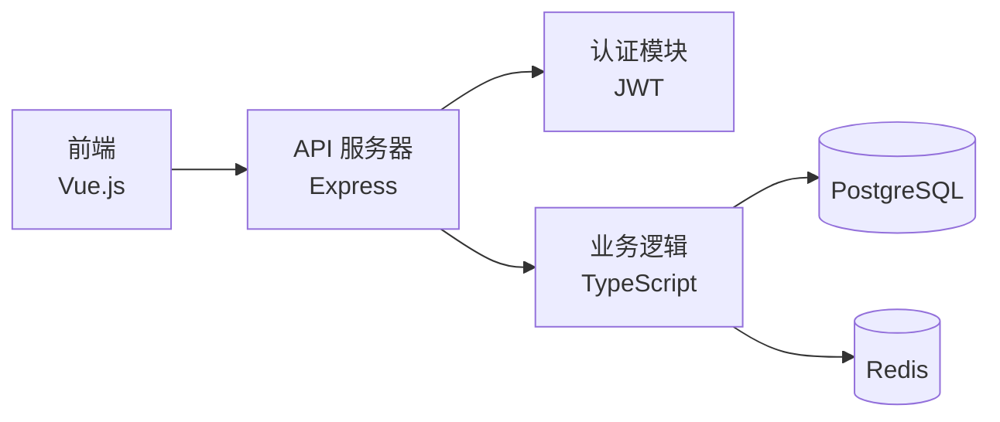
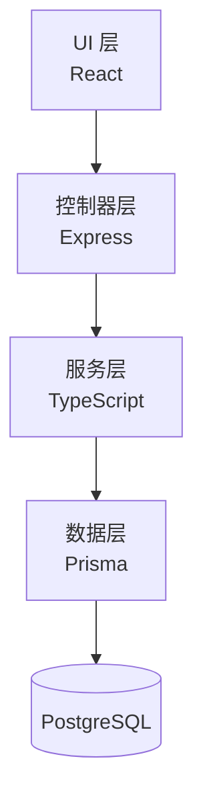
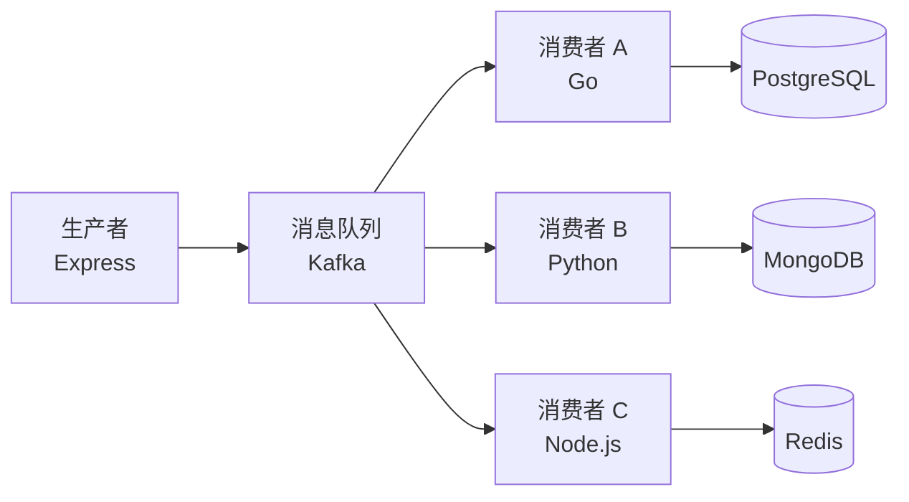

<div align="right">

[English](README.md) · 中文 · [日本語](README-ja.md) · [한국어](README-ko.md) · [Русский](README-ru.md)

</div>

# general-readme-skill

> 使用 AI 编程助手为任何项目生成专业的 README 文件


## 功能特性

| 功能 | 描述 |
|---|---|
| 多种写作风格 | 三种写作配置：活力型、简约型和专业型 |
| 徽章系统 | 自动生成 shields.io 徽章，支持三种视觉样式 |
| 多语言支持 | 支持生成英文、中文、日文、韩文、俄文等 README 文件 |
| 零依赖 | 无需外部 CLI、运行时或网络服务 |
| 多平台支持 | 兼容 Claude Code、GitHub Copilot 和 Cursor |
| 隐私保护 | 自动屏蔽敏感密钥、密码和私人信息 |

## 工作流程概览

技能遵循 **配置 → 扫描 → 生成 → 输出** 的流水线：


## 阶段 1：配置

在生成前收集配置选项。所有选项都有固定的默认值。

### 1.1 写作风格选择

选择 README 的写作风格：

| 风格 | 特点 | 参考 | 适用场景 |
|---|---|---|---|
| **活力型** | 直接、自信、允许使用表情符号 | FastAPI | 开源项目、开发者工具 |
| **简约型** | 简洁、代码优先、无冗余描述 | Tailwind CSS | CLI 工具、库 |
| **专业型** | 中立、结构化、正式布局 | Kubernetes | 企业项目、文档 |

**示例 — 同一功能的三种风格：**

<details>
<summary><b>活力型风格</b></summary>

```markdown
## 功能特性

- ⚡ **极速响应** — 亚毫秒级响应时间
- 🔒 **默认安全** — 开箱即用的 JWT 认证、CORS、速率限制
- 🎯 **类型安全** — 完整的 TypeScript 推断，零 `any`
```
</details>

<details>
<summary><b>简约型风格</b></summary>

```markdown
## 功能特性

- 类型安全的 API，完整推断
- 零配置 TypeScript 支持
- 内置认证和速率限制
```
</details>

<details>
<summary><b>专业型风格</b></summary>

```markdown
## 功能特性

| 功能 | 描述 |
|---|---|
| 类型安全 | 零配置的完整 TypeScript 推断 |
| 认证 | 基于 JWT 的认证，支持基于角色的访问控制 |
```
</details>

### 1.2 徽章样式选择

选择 shields.io 徽章外观：

| 样式 | 参数 | 预览 |
|---|---|---|
| **扁平**（默认） | `style=flat` |  |
| **扁平方形** | `style=flat-square` |  |
| **大号** | `style=for-the-badge` |  |

### 1.3 多语言设置

- **主要语言**（默认：英文）
- **次要语言**（可选：中文、日文、韩文、西班牙文、法文、俄文等）

文件命名遵循 ISO 639-1 代码：

| 语言 | 文件 | 代码 |
|---|---|---|
| 英文（主要） | `README.md` | — |
| 简体中文 | `README-zh.md` | zh |
| 日文 | `README-ja.md` | ja |
| 韩文 | `README-ko.md` | ko |
| 俄文 | `README-ru.md` | ru |

---

## 阶段 2：项目扫描

使用内置工具扫描本地项目目录。**只读取静态文件 — 永远不执行、修改或删除。**

### 2.1 检测流水线



### 2.2 检测内容

| 检测项 | 源文件 | 输出 |
|---|---|---|
| **语言** | package.json, pyproject.toml, go.mod, Cargo.toml | 主要语言 |
| **框架** | dependencies/devDependencies 字段 | React, Vue, Express, Django 等 |
| **构建/CI** | Makefile, Dockerfile, .github/workflows | 构建命令、CI 流水线 |
| **数据库** | DATABASE_URL, ORM 配置 | PostgreSQL, Redis, Prisma 等 |
| **架构** | 目录结构, .proto 文件 | 微服务、单体等 |
| **API 风格** | 路由文件, .proto, .graphql | REST, gRPC, GraphQL, WebSocket |
| **许可证** | LICENSE, LICENSE.md | MIT, Apache-2.0, GPL-3.0 等 |
| **项目类型** | package.json scripts, bin 字段 | 库、应用、CLI、静态站点 |

### 2.3 扫描输出示例

对于一个典型的 Node.js 项目（含 `package.json`）：

```
┌─ 语言: TypeScript
├─ 框架: Express, Prisma
├─ 数据库: PostgreSQL, Redis
├─ 构建: npm scripts, Docker
├─ CI: GitHub Actions
├─ API: REST
├─ 许可证: MIT
└─ 类型: 应用程序
```

---

## 阶段 3：生成内容

加载参考文件，然后按照**固定章节顺序**（倒金字塔）生成内容。

### 3.1 参考文件

所有参考文件位于 `references/` 文件夹：

| 文件 | 用途 |
|---|---|
| `tone-profiles.md` | 3 种写作风格的规则和示例短语 |
| `badge-styles.md` | 徽章布局和分组规则 |
| `badges.md` | 技术 → shields.io 徽章 URL 映射（150+ 条目） |
| `diagram-templates.md` | Mermaid 模板 + SVG 后备方案 |
| `section-guidelines.md` | 章节写作规则和禁用短语 |
| `language-guide.md` | 多语言命名和切换器规则 |

### 3.2 固定章节顺序

章节按此顺序生成。**如果没有匹配的项目数据，跳过该章节。**



### 3.3 章节示例

#### 标题区

```markdown
# 项目名称

> 一句话描述项目功能


```

#### 功能特性（专业型风格）

```markdown
## 功能特性

| 功能 | 描述 |
|---|---|
| 类型安全 | 零配置的完整 TypeScript 推断 |
| 认证 | 基于 JWT 的认证，支持基于角色的访问控制 |
```

#### 快速开始

```markdown
## 快速开始

### 前置要求

- Node.js 18+
- PostgreSQL 14+

### 安装

```bash
npm install my-package
```

### 配置

```bash
cp .env.example .env
```

### 运行

```bash
npm run dev
```
```

#### 架构图

```markdown
## 架构


```

#### 目录结构

```markdown
## 项目结构

```
src/
├── api/              # API 路由处理器
├── services/         # 业务逻辑
├── models/           # 数据库模型
└── index.ts          # 入口文件
```
```

### 3.4 图表模板

技能包含预构建的 Mermaid 模板，适用于常见架构：

#### 微服务架构



#### 前后端分离



#### 单体分层



#### 事件驱动



### 3.5 徽章分组规则

徽章按以下顺序分组：

| 行 | 内容 | 最大数量 |
|---|---|---|
| 第 1 行 — 标识 | 构建状态、版本、许可证、主要语言 | 4 |
| 第 2 行 — 技术栈 | 框架、数据库、关键工具 | 6 |
| 第 3+ 行 — 条件 | 下载量、星标、覆盖率（仅在数据存在时） | — |

**示例：**

```markdown


```

### 3.6 关键生成规则

1. **禁止编造** — 所有功能、命令、代码示例必须来自真实项目文件
2. **风格一致** — 所有文本遵循选定的写作风格
3. **徽章规则** — 遵循 `badge-styles.md` 中的分组和样式
4. **隐私保护** — 屏蔽敏感密钥、密码和私人信息
5. **增量更新** — 保留用 `<!-- MANUAL-START -->` / `<!-- MANUAL-END -->` 标记的手动内容

---

## 阶段 4：输出

### 4.1 文件生成

1. 生成主要语言的 `README.md`
2. 生成次要语言文件：`README-{lang}.md`
3. 在每个 README 文件顶部添加语言切换器

**语言切换器格式：**

```markdown
<div align="right">

English · [中文](README-zh.md) · [日本語](README-ja.md) · [한국어](README-ko.md) · [Русский](README-ru.md)

</div>
```

### 4.2 输出格式

- UTF-8 编码
- 统一换行符（LF）
- 章节间干净的空行
- 无尾随空白

---

## 快速开始

### Claude Code

```bash
mkdir -p .claude/skills/general-readme
cp SKILL.md .claude/skills/general-readme/
cp -r references/ .claude/skills/general-readme/
```

### GitHub Copilot

```bash
mkdir -p .github
cp SKILL.md .github/copilot-instructions.md
cp -r references/ .github/copilot-instructions/references/
```

### Cursor

```bash
mkdir -p .cursor/rules
cp SKILL.md .cursor/rules/general-readme.mdc
cp -r references/ .cursor/rules/references/
```

## 使用方法

在 AI 编程助手中输入 `/readme` 或说 "generate readme"。

### 支持的命令

| 命令 | 描述 |
|---|---|
| `/readme` | 触发 README 生成 |
| `generate readme` | 自然语言触发 |
| `write readme` | 自然语言触发 |
| `帮我写 README` | 中文语言触发 |
| `更新README` | 更新现有 README |

### 示例会话

```
用户: /readme

AI: 请选择 README 的写作风格：
    1. Professional (专业) — 默认
    2. Energetic (活力)
    3. Minimal (简约)

用户: 1

AI: 请选择徽章样式：
    1. Flat (扁平) — 默认
    2. Flat-square (扁平方形)
    3. For-the-badge (大号)

用户: 1

AI: 请选择主要语言：
    1. English (英文) — 默认
    2. Chinese (中文)

用户: 1

AI: 是否需要添加次要语言？
    [不需要] [中文] [日语] [韩语]

用户: 不需要

AI: 正在扫描项目结构...
    检测到: TypeScript, Express, PostgreSQL
    正在生成 README.md...
    
    ✅ README.md 生成完成！请检查并根据需要调整。
```

## 项目结构

```
general-readme-skill/
├── SKILL.md                    # 主技能定义文件
├── LICENSE                     # MIT 许可证
├── README.md                   # 本文件
├── examples/                   # 示例 README 文件
│   ├── app-readme.md           # 全栈应用示例
│   ├── cli-readme.md           # CLI 工具示例
│   └── library-readme.md       # 库/包示例
├── install/                    # 安装指南
│   ├── claude-code.md          # Claude Code 设置
│   ├── copilot.md              # GitHub Copilot 设置
│   └── cursor.md               # Cursor 设置
└── references/                 # 参考文件
    ├── badges.md               # 技术徽章映射（150+ 条目）
    ├── badge-styles.md         # 徽章布局规则
    ├── diagram-templates.md    # Mermaid + SVG 模板
    ├── language-guide.md       # 多语言规则
    ├── section-guidelines.md   # 章节写作规则
    └── tone-profiles.md        # 3 种写作风格定义
```

## 技术栈

### 文档

| 技术 | 用途 |
|---|---|
| Markdown | 主要内容格式 |
| shields.io | 徽章生成（150+ 技术映射） |
| Mermaid | 架构图（4 种模板类型） |

### 支持平台

| 平台 | 集成方式 |
|---|---|
| Claude Code | `.claude/skills/` 目录 |
| GitHub Copilot | `.github/copilot-instructions.md` |
| Cursor | `.cursor/rules/` 目录 |

## 贡献

1. Fork 仓库
2. 创建功能分支 (`git checkout -b feature/amazing`)
3. 提交更改 (`git commit -m 'feat: add amazing feature'`)
4. 推送到分支 (`git push origin feature/amazing`)
5. 打开 Pull Request

## 许可证

[MIT](LICENSE)
