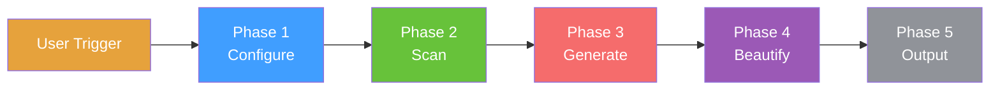
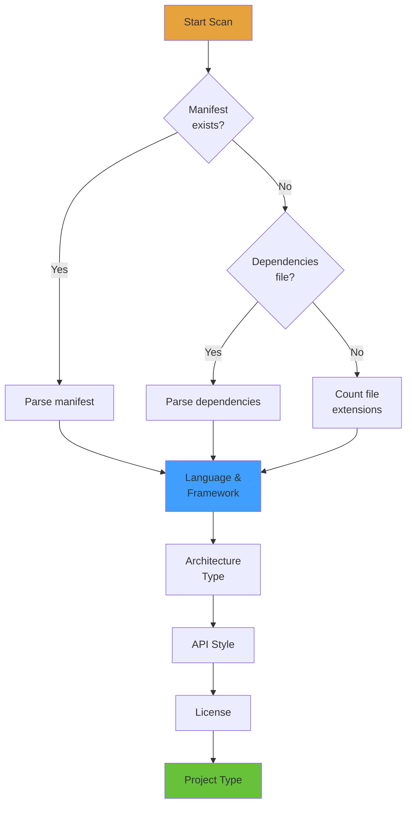
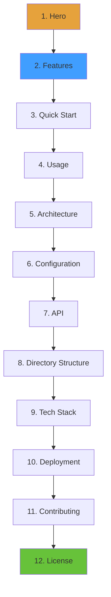
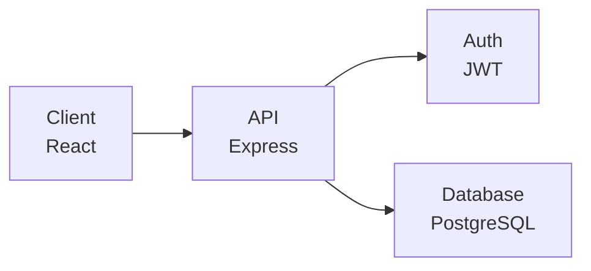
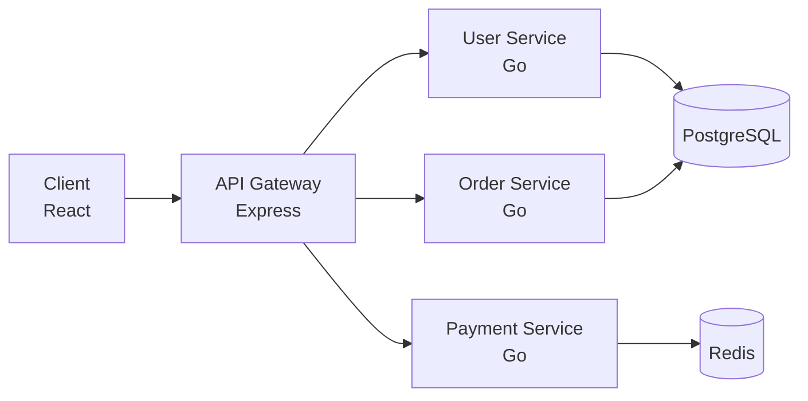
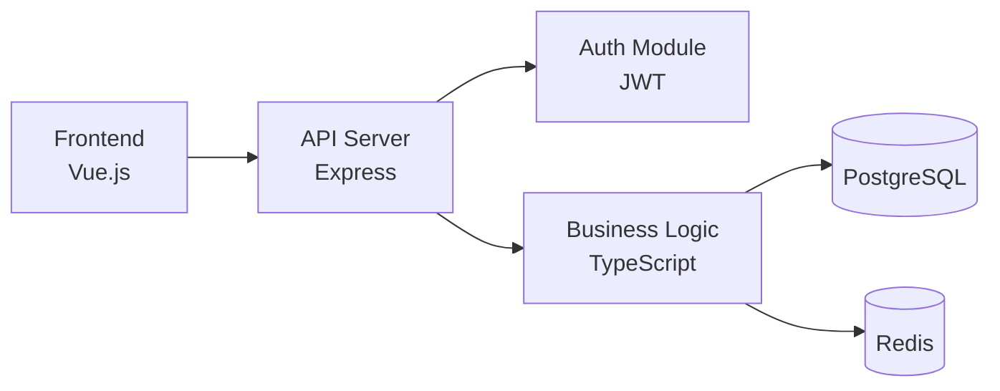
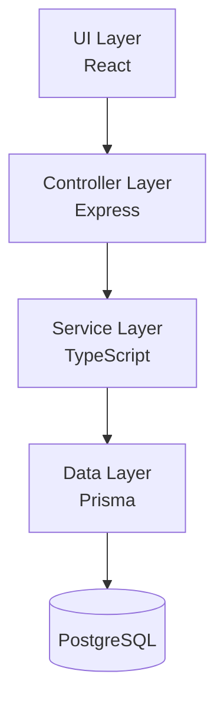
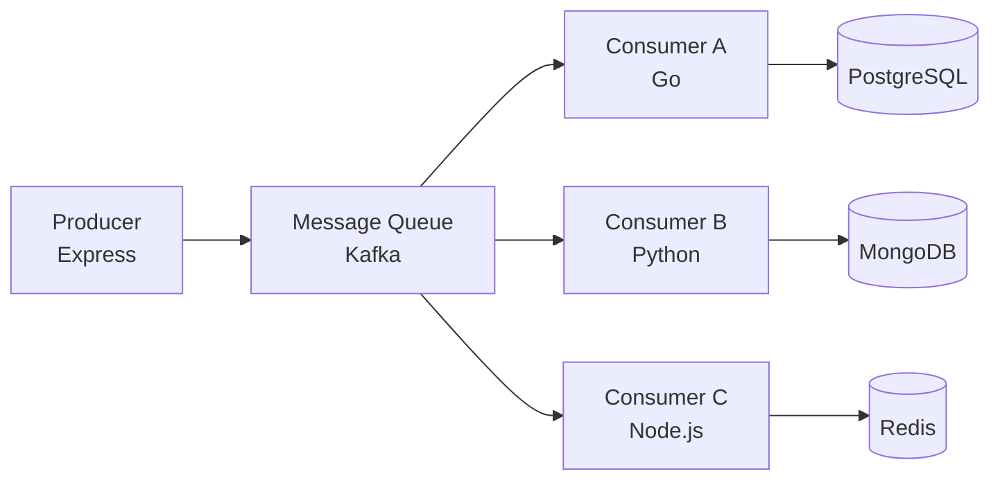

<h1 align="center">General README Skill</h1>
<p align="center">
  <strong>Generate professional README files for any project using AI coding assistants</strong>
  <br />
  <em>Zero Dependencies · Multi-Platform · Multi-Language · Supports Claude Code, Copilot, Cursor, and more</em>
</p>

<p align="center">
  <a href="#quick-start"></a>
  <a href="LICENSE"></a>
</p>

<p align="center">
  <a href="https://docs.anthropic.com/en/docs/claude-code"></a>
  <a href="https://github.com/features/copilot"></a>
  <a href="https://cursor.sh"></a>
</p>

<p align="center">
  <a href="README.md">English</a> · <a href="README-zh.md">中文</a> · <a href="README-ja.md">日本語</a> · <a href="README-ko.md">한국어</a> · <a href="README-ru.md">Русский</a>
</p>

## Features

| Feature | Description |
|---|---|
| Multi-Tone Support | Three writing profiles: Energetic, Minimal, and Professional |
| Badge System | Automatic shields.io badge generation with three visual styles |
| Multi-Language | Generate README files in English, Chinese, Japanese, Korean, Russian, and more |
| Zero Dependencies | No external CLI, runtime, or network service required |
| Multi-Platform | Works with Claude Code, GitHub Copilot, and Cursor |
| Privacy-First | Automatic masking of sensitive keys, passwords, and private information |

## Workflow Overview

The skill follows a **Configure → Scan → Generate → Beautify → Output** pipeline:



## Phase 1: Configuration

Collect configuration options before generation. All options have fixed default values.

### 1.1 Tone Profile Selection

Choose the README writing style:

| Profile | Voice | Reference | Use Case |
|---|---|---|---|
| **Energetic** | Direct, confident, allows emojis | FastAPI | Open source, developer tools |
| **Minimal** | Terse, code-first, no redundancy | Tailwind CSS | CLI tools, libraries |
| **Professional** | Neutral, structured, formal | Kubernetes | Enterprise, documentation |

**Example — Same feature in three tones:**

<details>
<summary><b>Energetic Style</b></summary>

```markdown
## Features

- ⚡ **Blazing fast** — Sub-millisecond response times
- 🔒 **Secure by default** — JWT auth, CORS, rate limiting out of the box
- 🎯 **Type-safe** — Full TypeScript inference, zero `any`
```
</details>

<details>
<summary><b>Minimal Style</b></summary>

```markdown
## Features

- Type-safe API with full inference
- Zero-config TypeScript support
- Built-in authentication and rate limiting
```
</details>

<details>
<summary><b>Professional Style</b></summary>

```markdown
## Features

| Feature | Description |
|---|---|
| Type Safety | Full TypeScript inference with zero configuration |
| Authentication | JWT-based auth with role-based access control |
```
</details>

### 1.2 Badge Style Selection

Choose shields.io badge appearance:

| Style | Parameter | Preview |
|---|---|---|
| **Flat** (default) | `style=flat` |  |
| **Flat-square** | `style=flat-square` |  |
| **For-the-badge** | `style=for-the-badge` |  |

### 1.3 Multi-Language Setting

- **Primary language** (default: English)
- **Secondary languages** (optional: Chinese, Japanese, Korean, Spanish, French, Russian, etc.)

File naming follows ISO 639-1 codes:

| Language | File | Code |
|---|---|---|
| English (primary) | `README.md` | — |
| Chinese (Simplified) | `README-zh.md` | zh |
| Japanese | `README-ja.md` | ja |
| Korean | `README-ko.md` | ko |
| Russian | `README-ru.md` | ru |

---

## Phase 2: Project Scan

Use built-in tools to scan the local project directory. **Only read static files — never execute, modify, or delete.**

### 2.1 Detection Pipeline



### 2.2 What Gets Detected

| Detection | Source Files | Output |
|---|---|---|
| **Language** | package.json, pyproject.toml, go.mod, Cargo.toml | Primary language |
| **Framework** | dependencies/devDependencies fields | React, Vue, Express, Django, etc. |
| **Build/CI** | Makefile, Dockerfile, .github/workflows | Build commands, CI pipeline |
| **Database** | DATABASE_URL, ORM configs | PostgreSQL, Redis, Prisma, etc. |
| **Architecture** | Directory structure, .proto files | Microservice, Monolithic, etc. |
| **API Style** | Route files, .proto, .graphql | REST, gRPC, GraphQL, WebSocket |
| **License** | LICENSE, LICENSE.md | MIT, Apache-2.0, GPL-3.0, etc. |
| **Project Type** | package.json scripts, bin field | Library, Application, CLI, Static |

### 2.3 Example Scan Output

For a typical Node.js project with `package.json`:

```
┌─ Language: TypeScript
├─ Framework: Express, Prisma
├─ Database: PostgreSQL, Redis
├─ Build: npm scripts, Docker
├─ CI: GitHub Actions
├─ API: REST
├─ License: MIT
└─ Type: Application
```

---

## Phase 3: Generate Content

Load reference files, then generate content following the **Fixed Section Order** (Inverted Pyramid).

### 3.1 Reference Files

All references located in `references/` folder:

| File | Purpose |
|---|---|
| `tone-profiles.md` | Style rules & sample phrases for 3 tones |
| `badge-styles.md` | Badge layout & grouping rules |
| `badges.md` | Technology → shields.io badge URL mapping |
| `diagram-templates.md` | Mermaid templates + SVG fallback |
| `section-guidelines.md` | Section writing rules & banned phrases |
| `language-guide.md` | Multi-language naming & switcher rules |

### 3.2 Fixed Section Order

Sections are generated in this order. **Skip any section if no matching project data.**



### 3.3 Section Examples

#### Hero Section

```markdown
# Project Name

> One-line description of what the project does


```

#### Features Section (Professional Tone)

```markdown
## Features

| Feature | Description |
|---|---|
| Type Safety | Full TypeScript inference with zero configuration |
| Authentication | JWT-based auth with role-based access control |
```

#### Quick Start Section

````markdown
## Quick Start

### Prerequisites

- Node.js 18+
- PostgreSQL 14+

### Install

```bash
npm install my-package
```

### Configure

```bash
cp .env.example .env
```

### Run

```bash
npm run dev
```
````

#### Architecture Diagram

````markdown
## Architecture


````

#### Directory Structure

````markdown
## Project Structure

```
src/
├── api/              # API route handlers
├── services/         # Business logic
├── models/           # Database models
└── index.ts          # Entry point
```
````

### 3.4 Diagram Templates

The skill includes pre-built Mermaid templates for common architectures:

#### Microservice Architecture



#### Frontend-Backend Separation



#### Monolithic Layered



#### Event-Driven



### 3.5 Badge Grouping Rules

Badges are grouped in this order:

| Line | Content | Max |
|---|---|---|
| Line 1 — Identity | Build status, Version, License, Primary language | 4 |
| Line 2 — Tech Stack | Framework, Database, Key tools | 6 |
| Line 3+ — Conditional | Downloads, Stars, Coverage (only if data exists) | — |

**Example:**

```markdown


```

### 3.6 Critical Generation Rules

1. **No fabrication** — All features, commands, code examples must come from real project files
2. **Style consistency** — All text follows selected Tone Profile
3. **Badge rules** — Follow grouping & style in `badge-styles.md`
4. **Privacy protection** — Mask sensitive keys, passwords, and private info
5. **Incremental update** — Preserve manual content marked with `<!-- MANUAL-START -->` / `<!-- MANUAL-END -->`

---

## Phase 4: Beautification (Auto-Triggered)

After Phase 3 generates the README, this phase automatically enhances visual presentation by replacing suitable Markdown syntax with HTML.

### 4.1 Execution Flow

**Step 1: Analysis (Automatic)**
Scan the generated README and identify beautifiable elements.

**Step 2: Confirmation (User Interaction)**
Display beautification suggestions to user:

```
AI: README generation complete! Analyzing beautification opportunities...

Found the following beautification suggestions:

1. ✅ [Hero] Title centered → <h1 align="center">
2. ✅ [Hero] Description centered and bold → <p align="center"><strong>
3. ✅ [Hero] Add CTA buttons
4. ✅ [Hero] Platform badges centered
5. ⚪ [Content] Tables keep Markdown (easier to maintain)
6. ⚪ [Code] Code blocks keep Markdown (has syntax highlighting)

Accept these suggestions?
[Accept All] [Confirm Each] [Reject All]
```

**Step 3: Execution (Automatic)**
Apply selected beautifications based on user confirmation.

### 4.2 Beautification Rules

| Region | Strategy | Reason |
|---|---|---|
| **Hero** | Always beautify (HTML) | Significant visual improvement |
| **Content** | Keep Markdown | Easier to maintain |
| **Code/Diagrams** | Keep Markdown | Syntax highlighting / GitHub native support |
| **Structure** | Keep Markdown | GitHub styling sufficient |

For detailed rules and HTML templates, see `references/beautification-rules.md`.

---

## Phase 5: Output

### 5.1 File Generation

1. Generate primary `README.md` in selected primary language
2. Generate secondary files: `README-{lang}.md` for each extra language
3. Add language switcher on top of every README file

**Language Switcher Format:**

```html
<p align="center">
  <a href="README.md">English</a> · <a href="README-zh.md">中文</a> · <a href="README-ja.md">日本語</a> · <a href="README-ko.md">한국어</a> · <a href="README-ru.md">Русский</a>
</p>
```

### 5.2 Output Format

- UTF-8 encoding
- Unified line breaks (LF)
- Clean empty lines between sections
- No trailing whitespace

---

## Quick Start

### Claude Code

```bash
mkdir -p .claude/skills/general-readme
cp SKILL.md .claude/skills/general-readme/
cp -r references/ .claude/skills/general-readme/
```

### GitHub Copilot

```bash
mkdir -p .github
cp SKILL.md .github/copilot-instructions.md
cp -r references/ .github/copilot-instructions/references/
```

### Cursor

```bash
mkdir -p .cursor/rules
cp SKILL.md .cursor/rules/general-readme.mdc
cp -r references/ .cursor/rules/references/
```

## Usage

Type `/readme` or say "generate readme" in your AI coding assistant.

### Supported Commands

| Command | Description |
|---|---|
| `/readme` | Trigger README generation |
| `generate readme` | Natural language trigger |
| `write readme` | Natural language trigger |
| `帮我写 README` | Chinese language trigger |
| `更新README` | Update existing README |

### Example Session

```
User: /readme

AI: 请选择 README 的写作风格：
    1. Professional (专业) — 默认
    2. Energetic (活力)
    3. Minimal (简约)

User: 1

AI: 请选择徽章样式：
    1. Flat (扁平) — 默认
    2. Flat-square (扁平方形)
    3. For-the-badge (大号)

User: 1

AI: 请选择主要语言：
    1. English (英文) — 默认
    2. Chinese (中文)

User: 1

AI: 是否需要添加次要语言？
    [不需要] [中文] [日语] [韩语]

User: 不需要

AI: 正在扫描项目结构...
    检测到: TypeScript, Express, PostgreSQL
    正在生成 README.md...
    
    ✅ README.md 生成完成！正在分析美化机会...

    发现以下可美化项目：

    1. ✅ [Hero] 标题居中 → <h1 align="center">
    2. ✅ [Hero] 描述居中加粗 → <p align="center"><strong>
    3. ✅ [Hero] 添加 CTA 按钮
    4. ✅ [Hero] 平台徽章居中
    5. ⚪ [内容] 表格保持 Markdown（更易维护）
    6. ⚪ [代码] 代码块保持 Markdown（有语法高亮）

    是否接受这些建议？
    [全部接受] [逐条确认] [全部拒绝]

User: 全部接受

AI: 正在执行美化...
    ✅ README.md 已生成并美化完成！请检查并根据需要调整。
```

## Project Structure

```
general-readme-skill/
├── SKILL.md                    # Main skill definition
├── LICENSE                     # MIT License
├── README.md                   # This file
├── examples/                   # Example README files
│   ├── app-readme.md           # Full-stack application example
│   ├── cli-readme.md           # CLI tool example
│   └── library-readme.md       # Library/package example
├── install/                    # Installation guides
│   ├── claude-code.md          # Claude Code setup
│   ├── copilot.md              # GitHub Copilot setup
│   └── cursor.md               # Cursor setup
└── references/                 # Reference files
    ├── badges.md               # Technology badge mapping (150+ entries)
    ├── badge-styles.md         # Badge layout rules
    ├── beautification-rules.md # Phase 4 beautification rules & HTML templates
    ├── diagram-templates.md    # Mermaid + SVG templates
    ├── language-guide.md       # Multi-language rules
    ├── section-guidelines.md   # Section writing rules
    └── tone-profiles.md        # 3 writing tone definitions
```

## Tech Stack

### Documentation

| Technology | Purpose |
|---|---|
| Markdown | Primary content format |
| shields.io | Badge generation (150+ technology mappings) |
| Mermaid | Architecture diagrams (4 template types) |

### Supported Platforms

| Platform | Integration Method |
|---|---|
| Claude Code | `.claude/skills/` directory |
| GitHub Copilot | `.github/copilot-instructions.md` |
| Cursor | `.cursor/rules/` directory |

## Contributing

1. Fork the repository
2. Create a feature branch (`git checkout -b feature/amazing`)
3. Commit your changes (`git commit -m 'feat: add amazing feature'`)
4. Push to the branch (`git push origin feature/amazing`)
5. Open a Pull Request

## License

[MIT](LICENSE)
