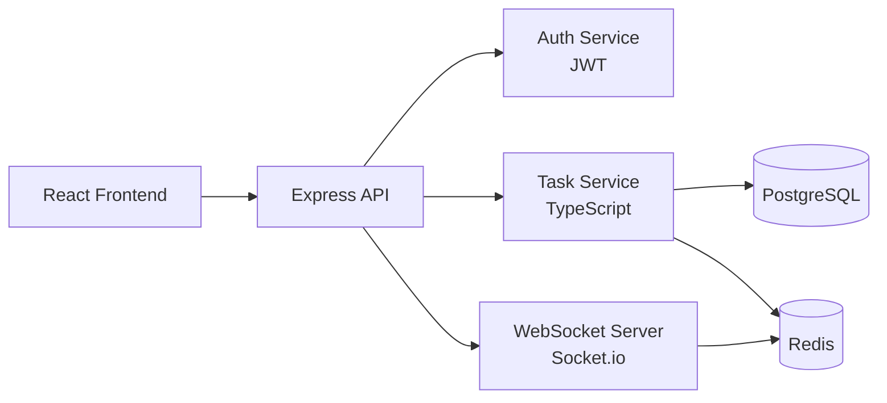

<!--
  Example: Application README
  Tone: Professional
  Badge style: Flat
  Project type: Full-stack application (taskboard)
  Sections: Hero, Features, Quick Start, Architecture, Configuration, API, Directory Structure, Tech Stack, Deployment, Contributing, License
  This example demonstrates a comprehensive README for a full-stack web application.
-->

<h1 align="center">Taskboard</h1>
<p align="center">
  <strong>A collaborative task management application with real-time updates</strong>
  <br />
  <em>TypeScript · React · Node.js · PostgreSQL · Real-time Collaboration</em>
</p>

<p align="center">
  <a href="#quick-start"></a>
  <a href="LICENSE"></a>
</p>

<p align="center">
  <a href="https://docs.anthropic.com/en/docs/claude-code"></a>
  <a href="https://github.com/features/copilot"></a>
  <a href="https://cursor.sh"></a>
</p>

<p align="center">
  <a href="README.md">English</a> · <a href="README-zh.md">中文</a> · <a href="README-ja.md">日本語</a>
</p>

---

<p align="center">
  
  
  
  
  
  
  
  
</p>

## Features

| Feature | Description |
|---|---|
| Real-time Collaboration | WebSocket-based updates across all connected clients |
| Task Management | Create, assign, track, and filter tasks with drag-and-drop boards |
| Team Workspaces | Isolated workspaces with role-based access control |
| Notifications | Email and in-app notifications for task assignments and updates |
| Search | Full-text search across tasks, comments, and descriptions |
| API Access | RESTful API for integrations and custom workflows |

## Quick Start

### Docker (Recommended)

```bash
docker-compose up -d
```

The application is available at `http://localhost:3000`.

### Manual Setup

#### Prerequisites

- Node.js 18+
- PostgreSQL 14+
- Redis 6+

#### Install Dependencies

```bash
npm install
```

#### Configure

```bash
cp .env.example .env
# Edit .env with your database and Redis credentials
```

#### Initialize Database

```bash
npm run db:migrate
npm run db:seed
```

#### Start Development Server

```bash
npm run dev
```

The application is available at `http://localhost:3000`.

## Architecture



## Configuration

### Environment Variables

| Variable | Description | Default |
|---|---|---|
| `DATABASE_URL` | PostgreSQL connection string | — |
| `REDIS_URL` | Redis connection string | `redis://localhost:6379` |
| `JWT_SECRET` | Secret key for JWT signing | — |
| `PORT` | Server port | `3000` |
| `SMTP_HOST` | Email server host | — |
| `SMTP_PORT` | Email server port | `587` |
| `LOG_LEVEL` | Logging level (debug, info, warn, error) | `info` |

## API

### Authentication

All API endpoints require a Bearer token. Obtain one via `POST /api/auth/login`.

### Endpoints

| Method | Path | Description | Auth |
|---|---|---|---|
| POST | `/api/auth/register` | Register a new user | No |
| POST | `/api/auth/login` | Login and receive token | No |
| GET | `/api/workspaces` | List user's workspaces | Bearer |
| POST | `/api/workspaces` | Create a workspace | Bearer |
| GET | `/api/workspaces/:id/tasks` | List tasks in workspace | Bearer |
| POST | `/api/workspaces/:id/tasks` | Create a task | Bearer |
| PATCH | `/api/tasks/:id` | Update a task | Bearer |
| DELETE | `/api/tasks/:id` | Delete a task | Bearer |

## Project Structure

```
src/
├── api/                # Express route handlers
│   ├── auth.ts         # Authentication endpoints
│   ├── tasks.ts        # Task CRUD endpoints
│   └── workspaces.ts   # Workspace endpoints
├── services/           # Business logic
│   ├── auth.ts         # JWT handling, password hashing
│   ├── tasks.ts        # Task operations
│   └── notifications.ts # Email and in-app notifications
├── models/             # Database models (Prisma)
├── middleware/          # Express middleware
│   ├── auth.ts         # JWT verification
│   └── validation.ts   # Request validation
├── websocket/          # WebSocket handlers
└── index.ts            # Entry point
client/
├── src/
│   ├── components/     # React components
│   ├── pages/          # Route pages
│   ├── hooks/          # Custom hooks
│   └── stores/         # Zustand state stores
├── public/
└── index.html
prisma/
├── schema.prisma       # Database schema
└── migrations/         # Migration files
docker-compose.yml      # Docker Compose configuration
```

## Tech Stack

### Frontend

| Technology | Purpose |
|---|---|
| React 18 | UI framework |
| Zustand | State management |
| Tailwind CSS | Styling |
| Socket.io Client | Real-time updates |

### Backend

| Technology | Purpose |
|---|---|
| Express | HTTP server |
| Prisma | ORM and migrations |
| Socket.io | WebSocket server |
| JWT | Authentication |

### Infrastructure

| Technology | Purpose |
|---|---|
| Docker | Containerization |
| PostgreSQL | Primary database |
| Redis | Session store and pub/sub |
| GitHub Actions | CI/CD |

## Deployment

### Docker Compose (Production)

```bash
docker-compose -f docker-compose.prod.yml up -d
```

### CI/CD

This project uses GitHub Actions for continuous integration and deployment. See `.github/workflows/` for configuration details.

## Contributing

1. Fork the repository
2. Create a feature branch (`git checkout -b feature/amazing`)
3. Commit your changes (`git commit -m 'feat: add amazing feature'`)
4. Push to the branch (`git push origin feature/amazing`)
5. Open a Pull Request

Please read [CONTRIBUTING.md](CONTRIBUTING.md) for detailed guidelines.

## License

[Apache-2.0](LICENSE)
