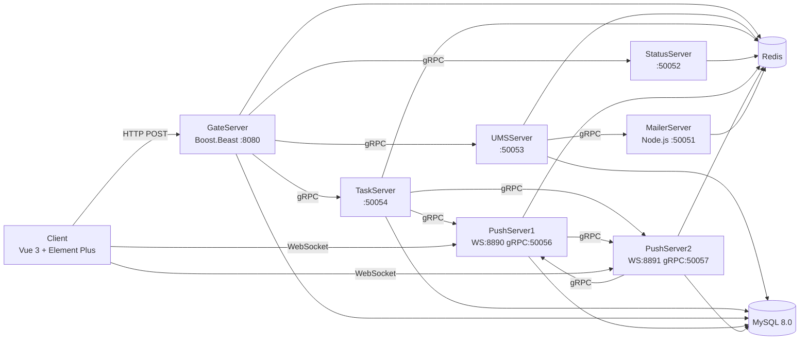

<!--
  Example: OxyTeamTasks README (https://github.com/KieranGao/OxyTeamTasks)
  Tone: Professional
  Badge style: Flat
  Project type: Full-stack application
-->

<!-- AUTO-GENERATED -->

<div align="right">

English · [中文](README-zh.md)

</div>

<h1 align="center">OxyTeamTask</h1>
<p align="center">
  <strong>Distributed training task coordination system for teams</strong>
  <br />
  <em>Microservice Architecture · gRPC · WebSocket Push · Role-Based Access Control</em>
</p>

<p align="center">
  <a href="#quick-start"></a>
  <a href="LICENSE"></a>
</p>

<p align="center">
  
  
  
  
  
  
</p>

<p align="center">
  
  
  
  
  
  
</p>

<p align="center">
  
  
</p>

---

## Features

| Feature | Description |
|---|---|
| **Microservice Architecture** | 6 independent services (5 C++ / 1 Node.js) communicating via gRPC, each with its own database access and connection pooling |
| **Real-Time Push Notifications** | WebSocket-based push with cross-node forwarding, auto-reconnect, and offline message caching via Redis |
| **Role-Based Access Control** | Three-tier roles (member, captain, coach) enforced at both frontend route guards and backend RPC handlers |
| **Per-Assignee Task Tracking** | Independent status tracking per assignee on shared tasks, with batch SQL population and rollback support |
| **Distributed Concurrency Safety** | Redis distributed locks with Lua atomic scripts for login tokens, message push, and unread counters |
| **Load-Balanced Push Servers** | Segment tree algorithm for O(log n) PushServer allocation by connection count, with horizontal scaling support |

---

## Quick Start

### Prerequisites

- C++17 compiler (GCC 9+ / Clang 10+)
- CMake 3.16+
- Node.js 18+
- MySQL 8.0
- Redis 6.0+
- Boost, Protobuf, gRPC, hiredis, mysqlcppconn (system libraries)

### Install Dependencies

```bash
# System packages (Ubuntu/Debian)
sudo apt install libboost-all-dev libprotobuf-dev protobuf-compiler \
  libgrpc++-dev protobuf-compiler-grpc libhiredis-dev libmysqlcppconn-dev

# Frontend dependencies
cd Client && npm install

# MailerServer dependencies
cd MailerServer && npm install
```

### Configure

```bash
# Initialize database
mysql -u root -p < user.sql
mysql -u root -p oxytasks < task.sql
mysql -u root -p oxytasks < task_assignments.sql
mysql -u root -p oxytasks < todo_list.sql
mysql -u root -p oxytasks < messages.sql

# Edit config.ini in each server directory with your MySQL/Redis credentials
# Edit MailerServer/config.json with your SMTP credentials
# Edit Client/config.json with your GateServer host/port
```

### Run

```bash
# Build all C++ servers
./build_all.sh

# Start all services (handles correct startup order)
./start_all.sh

# Start frontend dev server
cd Client && npm run dev
```

---

## Usage

### API Request (via GateServer)

All frontend requests go through GateServer (HTTP POST → gRPC translation):

```bash
# Login
curl -X POST http://localhost:8080/user_login \
  -H "Content-Type: application/json" \
  -d '{"email":"user@example.com","password":"hashed_password"}'

# List tasks
curl -X POST http://localhost:8080/task_list \
  -H "Content-Type: application/json" \
  -d '{"uid":0,"status":-1,"assigned_to":"0"}'

# Daily check-in
curl -X POST http://localhost:8080/checkin \
  -H "Content-Type: application/json" \
  -d '{"uid":1}'
```

### Direct gRPC Call (bypass GateServer)

```bash
# List tasks directly via TaskServer
grpcurl -plaintext -d '{"uid":1}' localhost:50054 message.TaskService/ListTasks
```

### WebSocket Push Client

```javascript
import { connectPushServer } from '@/utils/pushClient'

// After login, connect to push server
connectPushServer(host, port, uid, token)

// Listen for real-time notifications
onMessage('notify', (data) => { /* handle notification */ })
onMessage('task_new', (data) => { /* handle new task */ })
onMessage('kicked', (data) => { /* handle session kicked */ })
```

---

## Architecture



**Startup order**: StatusServer → UMSServer → TaskServer → PushServer1 → PushServer2 → GateServer

---

## API

All endpoints are `POST` via GateServer at `http://localhost:8080`. Responses use `{ "error": 0 }` for success.

### Authentication

| Endpoint | Description |
|---|---|
| `POST /get_verify_code` | Request email verification code |
| `POST /user_register` | Register new user (requires verification code) |
| `POST /user_login` | Login (returns uid, token, push server info) |
| `POST /user_resetpass` | Reset password with verification code |

### Tasks

| Endpoint | Description |
|---|---|
| `POST /task_create` | Create task with assignees |
| `POST /task_update` | Update task (uid=0 global, uid>0 per-assignee) |
| `POST /task_delete` | Delete task |
| `POST /task_get` | Get task with per-assignee statuses |
| `POST /task_list` | List tasks with filters (uid, status, assigned_to) |

### TODOs & Check-in

| Endpoint | Description |
|---|---|
| `POST /todo_add` | Add TODO item (priority, deadline) |
| `POST /todo_list` | List TODOs with filter |
| `POST /todo_update` | Update TODO |
| `POST /todo_delete` | Delete TODO |
| `POST /checkin` | Daily check-in (error 3001 if already done) |
| `POST /checkin_list` | List check-in records by date range |

### Messages

| Endpoint | Description |
|---|---|
| `POST /msg_list` | List messages with unread count |
| `POST /msg_read` | Mark messages as read |
| `POST /msg_delete` | Delete messages |

### Administration (Coach only)

| Endpoint | Description |
|---|---|
| `POST /user_list_pending` | List pending user registrations |
| `POST /user_approve` | Approve user (set role + team) |
| `POST /user_reject` | Reject user registration |
| `POST /user_set_role` | Change user role/team |
| `POST /user_list_all` | List all active users |
| `POST /user_update_team` | Update user team assignment |
| `POST /monitor/query_logs` | Query service logs |
| `POST /monitor/server_status` | Query server health status |

---

## Project Structure

```
OxyTasks/
├── GateServer/          # HTTP gateway (Boost.Beast), translates JSON→gRPC
│   ├── config.ini       # Server port, downstream service addresses, DB/Redis
│   ├── message.proto    # Protobuf service definitions
│   ├── LogicSystem.cpp  # HTTP route registration and handler logic
│   └── ...              # GrpcClients, MySQL/Redis pools, Logger
├── UMSServer/           # User Management Service (gRPC :50053)
│   └── UMSGrpcServiceImpl.cpp  # Register, Login, ResetPass, admin RPCs
├── TaskServer/          # Task/Todo/Checkin Service (gRPC :50054)
│   └── TaskGrpcServiceImpl.cpp # CRUD tasks, TODOs, check-ins, reminders
├── StatusServer/        # Service registry, load balancer, log aggregator (:50052)
│   └── SegmentTree.cpp  # O(log n) PushServer allocation algorithm
├── PushServer/          # WebSocket push + gRPC (:8890 WS, :50056 gRPC)
│   └── PushGrpcServiceImpl.cpp # PushToUser/Team, message persistence
├── PushServer2/         # Second PushServer instance (:8891 WS, :50057 gRPC)
├── MailerServer/        # Email verification service (Node.js, gRPC :50051)
│   ├── server.js        # gRPC server entry point
│   └── email.js         # Nodemailer SMTP transport
├── Client/              # Vue 3 SPA frontend
│   ├── src/views/       # 14 view components (auth, dashboard, taskboard, etc.)
│   ├── src/stores/      # Pinia stores (user auth, app theme)
│   ├── src/api/         # Axios API layer
│   └── src/utils/       # WebSocket client, SHA-256 crypto
├── jsoncpp/             # Vendored jsoncpp library
├── docs/                # Debug logs, design specs
├── *.sql                # Database schema files
├── build_all.sh         # Build all C++ servers
├── start_all.sh         # Start services in correct order
└── stop_all.sh          # Graceful shutdown
```

---

## Tech Stack

### Frontend

| Technology | Purpose |
|---|---|
| Vue 3 (Composition API) | UI framework with `<script setup>` syntax |
| Vue Router 4 | Hash-based routing for Electron compatibility |
| Pinia | State management (user auth, app theme, persisted to localStorage) |
| Element Plus | UI component library with auto-imported icons |
| Axios | HTTP client with auth header injection |
| Vite 5 | Build tool with dev proxy to GateServer |

### Backend (C++)

| Technology | Purpose |
|---|---|
| C++17 | Core language for 5 microservices |
| Boost.Beast / Asio | HTTP server (GateServer) and WebSocket server (PushServer) |
| gRPC + Protobuf | Inter-service communication (35 RPC methods across 5 services) |
| hiredis | Redis client for caching, distributed locks, session management |
| MySQL Connector/C++ | Database access with connection pooling |
| jsoncpp (vendored) | JSON parsing for HTTP request/response |

### Backend (Node.js)

| Technology | Purpose |
|---|---|
| @grpc/grpc-js | gRPC server for MailerService |
| Nodemailer | SMTP email delivery (verification codes) |
| ioredis | Redis client for code storage |

### Infrastructure

| Technology | Purpose |
|---|---|
| MySQL 8.0 | Persistent storage (users, tasks, TODOs, check-ins, messages) |
| Redis 6.0+ | Session tokens, distributed locks, message cache, unread counters, log aggregation |
| CMake | Build system for all C++ servers |

---

## Configuration

Each C++ server has a `config.ini` with the following sections:

| Section | Key Settings | Description |
|---|---|---|
| `[ServerName]` | host, port | This server's listen address |
| `[MySQL]` | host, port, user, password, dbName, poolSize | Database connection pool |
| `[Redis]` | host, port, password, poolSize | Redis connection pool |
| `[Log]` | level, flushInterval | Logging configuration |
| `[StatusServer]` | host, port | StatusServer address (for heartbeats) |

MailerServer uses `config.json` with SMTP, MySQL, and Redis credentials.

Client uses `config.json` at project root for GateServer host/port.

---

## Role System

| Role | Level | Capabilities |
|---|---|---|
| **Member** | 0 | View/complete assigned tasks, personal TODOs, daily check-in |
| **Captain** | 1 | Member + create tasks, manage team, view team progress |
| **Coach** | 2 | Captain + approve users, manage all teams, system monitoring |

New users register with `status=pending` and must be approved by a coach before they can log in.

---

## Contributing

1. Fork the repository
2. Create a feature branch (`git checkout -b feature/amazing`)
3. Commit your changes (`git commit -m 'feat: add amazing feature'`)
4. Push to the branch (`git push origin feature/amazing`)
5. Open a Pull Request

---

## License

[MIT](LICENSE)
