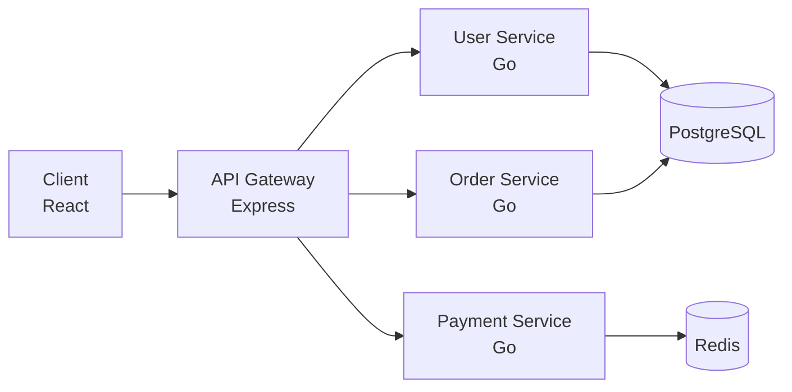
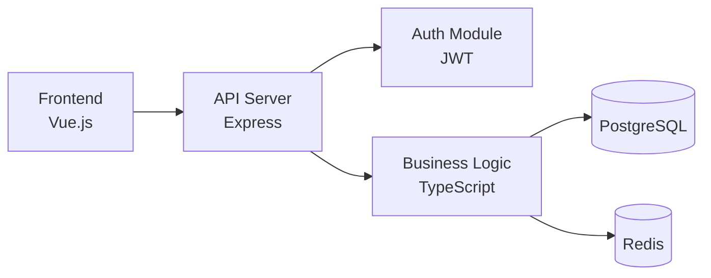
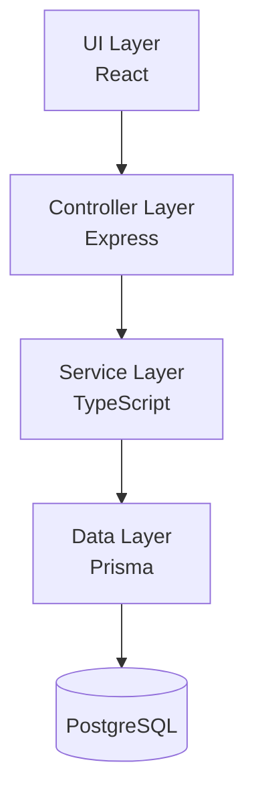
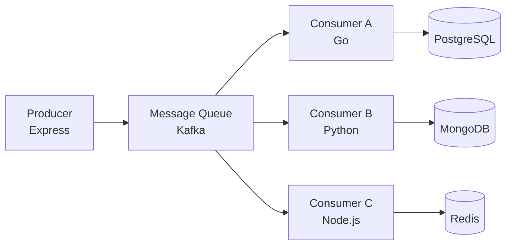

# Diagram Templates

Architecture diagram templates. Mermaid is the primary format — GitHub renders it natively. SVG is the fallback for complex architectures.

---

## When to Generate a Diagram

- **Library / CLI tool:** Skip. These rarely need architecture diagrams.
- **Application (full-stack):** Generate if the project has 3+ distinct components.
- **Microservice:** Generate if the project has 2+ services.
- **Monolithic:** Generate only if the architecture is non-obvious (layered, plugin-based, etc.).

---

## Mermaid Templates

### Microservice Architecture

For projects with multiple independent services communicating via RPC/HTTP.



**Rules:**
- `graph LR` for left-to-right flow
- Node labels: `Name<br/>Technology` (two lines)
- Database nodes: `[(Name)]` for cylinder shape
- Max 8 nodes. If more services exist, group related ones (e.g., "Auth Services" instead of listing each)
- No `style` or `classDef` directives — keep it GitHub-compatible

### Frontend-Backend Separation

For SPA + API + database projects.



### Monolithic Layered

For traditional MVC or layered architecture.



**Rules:**
- `graph TD` for top-down flow
- Each layer is one node
- Max 5 layers

### Event-Driven

For projects using message queues or event buses.



---

## SVG Fallback

Use SVG when:
- The architecture has >8 nodes and grouping would lose important detail
- The developer explicitly requests SVG
- The project needs branded/custom-styled diagrams

### Dynamic Layout Algorithm

SVG nodes are positioned dynamically, not hardcoded.

**Horizontal layout (client → gateway → services → data):**
- Column width: 180px (120px node + 60px gap)
- Node height: 60px
- Vertical gap between nodes in same column: 80px (center-to-center)
- Columns: client (x=20) → gateway (x=200) → services (x=380) → data (x=560)

**Canvas sizing:**
- Width: `num_columns × 180 + 40`
- Height: `max_nodes_in_any_column × 80 + 40`
- viewBox: `0 0 {WIDTH} {HEIGHT}`

**Connector lines:**
- From source node right edge to target node left edge
- For 1:many connections: lines fan from source center to each target center
- Arrow marker: `<marker>` with `polygon points="0 0, 10 3.5, 0 7"`

**Node structure:**
```svg
<rect x="{X}" y="{Y}" width="120" height="60" rx="8" fill="{COLOR}"/>
<text x="{X+60}" y="{Y+25}" text-anchor="middle" fill="white" font-size="14" font-weight="bold">{NAME}</text>
<text x="{X+60}" y="{Y+45}" text-anchor="middle" fill="white" font-size="11">{TECH}</text>
```

**Color scheme (light):**
- Client/Frontend: `#4A90D9` (blue)
- Gateway: `#E6A23C` (orange)
- Services: `#67C23A` (green)
- Data/DB: `#909399` (gray)
- Arrows: `#606266` (dark gray)

**Color scheme (dark):**
- Client/Frontend: `#3B82F6` (blue)
- Gateway: `#F59E0B` (amber)
- Services: `#10B981` (emerald)
- Data/DB: `#6B7280` (gray)
- Arrows: `#9CA3AF` (light gray)

---

## Decision Logic

```
if project_type is library or CLI:
    skip diagram
elif node_count <= 8:
    use Mermaid
elif developer requested SVG:
    use SVG with dynamic layout
else:
    use Mermaid with grouped nodes (combine related services into single nodes)
```
